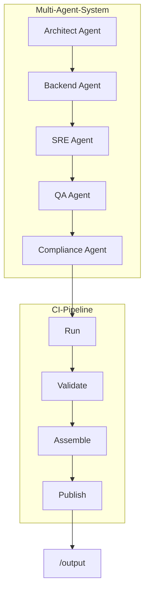
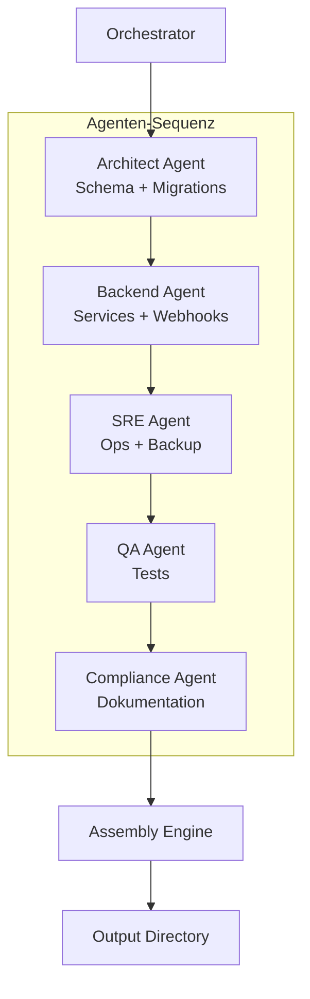
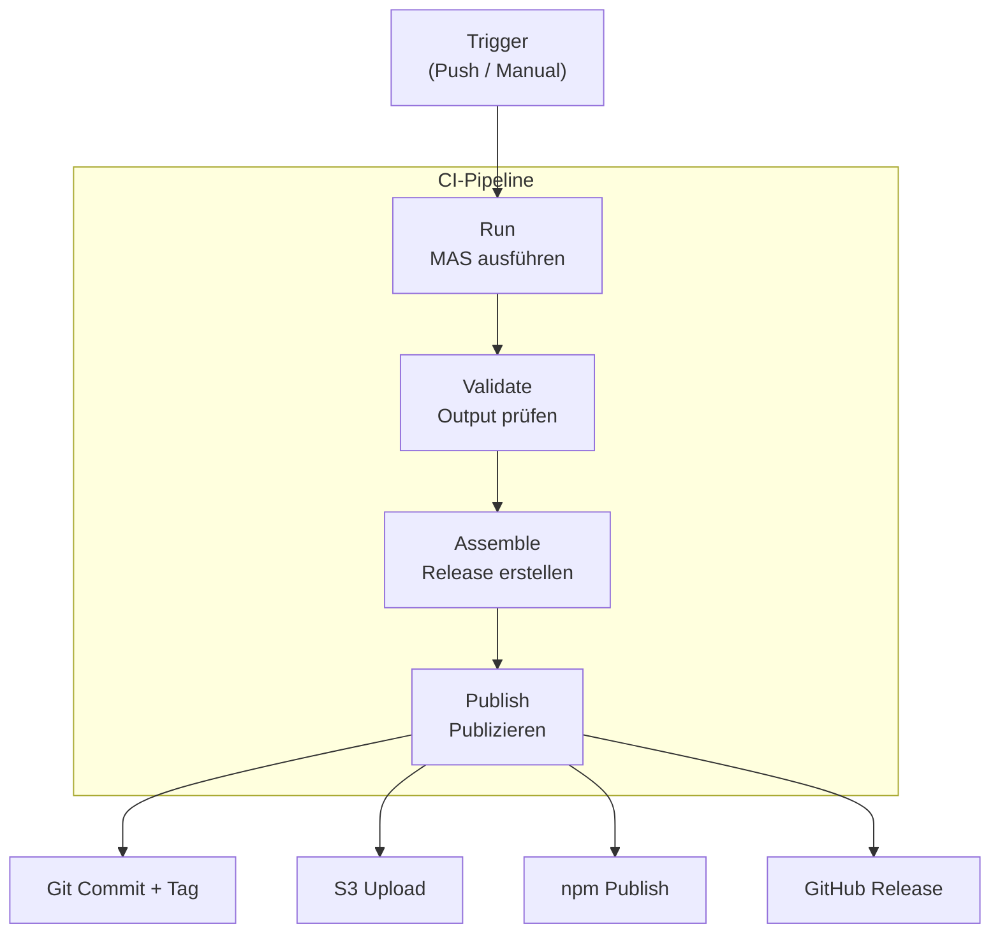
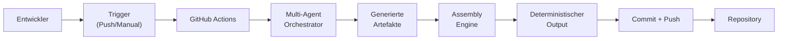
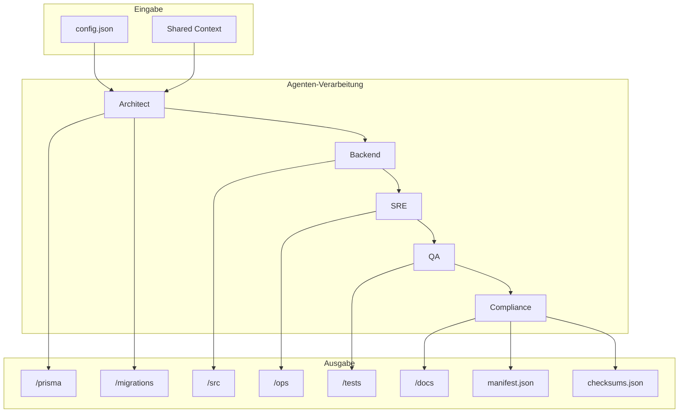
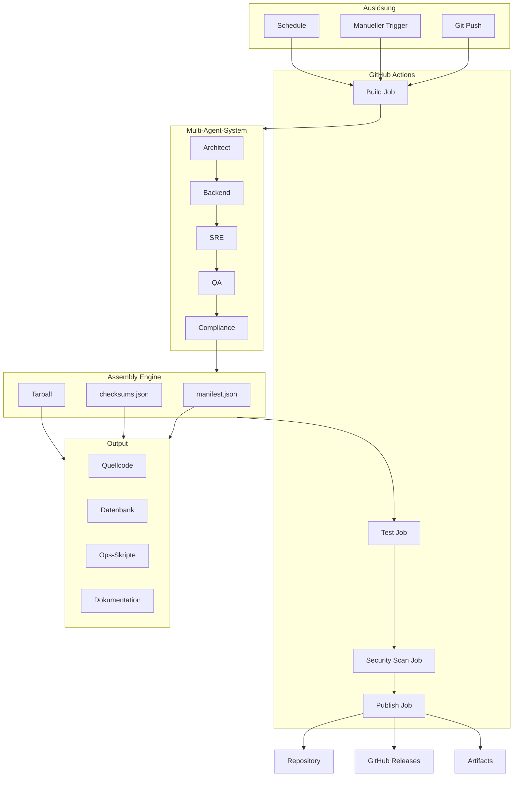
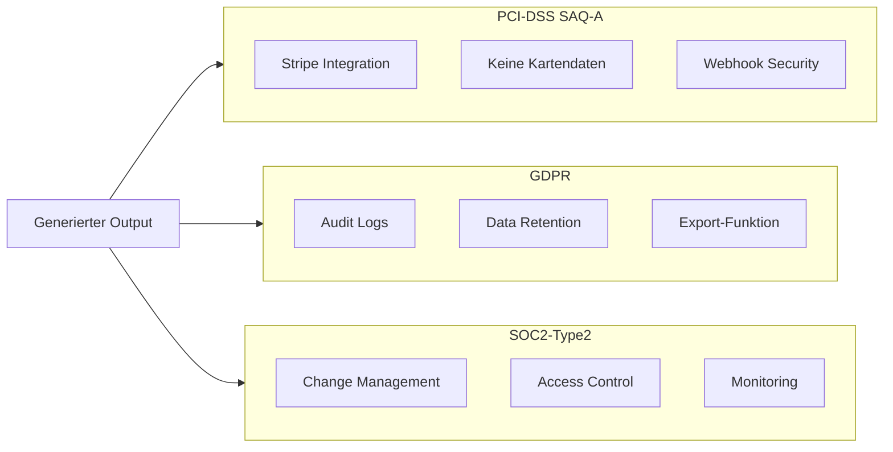

# Visual Architecture Diagram

> Vollständige visuelle Architektur des CargoBit Foundation Generator Systems

---

## 1. High-Level Systemarchitektur (ASCII)

```
┌──────────────────────────────────────────────────────────────────────┐
│                 CARGOBIT FOUNDATION GENERATOR                         │
│                                                                       │
│  ┌───────────────────────────┐     ┌────────────────────────────┐    │
│  │    Multi-Agent-System     │     │       CI-Pipeline          │    │
│  │                           │     │                            │    │
│  │  ┌─────────────────────┐  │     │  ┌──────────────────────┐  │    │
│  │  │  Architect Agent    │  │     │  │  Run                 │  │    │
│  │  │  (Schema, DB)       │  │     │  └──────────┬───────────┘  │    │
│  │  └─────────────────────┘  │     │             ▼              │    │
│  │  ┌─────────────────────┐  │     │  ┌──────────────────────┐  │    │
│  │  │  Backend Agent      │  │     │  │  Validate            │  │    │
│  │  │  (Services)         │  │     │  └──────────┬───────────┘  │    │
│  │  └─────────────────────┘  │     │             ▼              │    │
│  │  ┌─────────────────────┐  │     │  ┌──────────────────────┐  │    │
│  │  │  SRE Agent          │  │     │  │  Assemble            │  │    │
│  │  │  (Ops, Backup)      │  │     │  └──────────┬───────────┘  │    │
│  │  └─────────────────────┘  │     │             ▼              │    │
│  │  ┌─────────────────────┐  │     │  ┌──────────────────────┐  │    │
│  │  │  QA Agent           │  │     │  │  Publish             │  │    │
│  │  │  (Tests)            │  │     │  └──────────────────────┘  │    │
│  │  └─────────────────────┘  │     │                            │    │
│  │  ┌─────────────────────┐  │     └────────────────────────────┘    │
│  │  │  Compliance Agent   │  │                                       │
│  │  │  (Docs, Policies)   │  │                                       │
│  │  └─────────────────────┘  │                                       │
│  └─────────────┬─────────────┘                                       │
│                │                                                       │
│                ▼                                                       │
│  ┌───────────────────────────────────────────────────────────────┐   │
│  │                    ASSEMBLY ENGINE                             │   │
│  │                                                                │   │
│  │   • manifest.json erstellen                                    │   │
│  │   • checksums.json generieren                                  │   │
│  │   • Tarball paketieren                                         │   │
│  └────────────────────────────┬──────────────────────────────────┘   │
│                               │                                        │
│                               ▼                                        │
│  ┌───────────────────────────────────────────────────────────────┐   │
│  │                      OUTPUT DIRECTORY                          │   │
│  │                                                                │   │
│  │   /prisma        /migrations      /src         /ops            │   │
│  │   /tests         /docs            manifest.json checksums.json │   │
│  └───────────────────────────────────────────────────────────────┘   │
│                                                                       │
└──────────────────────────────────────────────────────────────────────┘
```

---

## 2. Multi-Agent-Flow (ASCII)

```
                        ┌─────────────────────────┐
                        │     ORCHESTRATOR        │
                        │                         │
                        │  • Lädt config.json     │
                        │  • Initialisiert Context│
                        │  • Sequenziert Agenten  │
                        └───────────┬─────────────┘
                                    │
                                    ▼
                ┌───────────────────────────────────────┐
                │          ARCHITECT AGENT              │
                │                                       │
                │  Output:                              │
                │  ├── prisma/schema.prisma             │
                │  ├── migrations/0001_init.sql         │
                │  └── migrations/0002_indexes.sql      │
                └───────────────────┬───────────────────┘
                                    │
                                    ▼
                ┌───────────────────────────────────────┐
                │          BACKEND AGENT                │
                │                                       │
                │  Output:                              │
                │  ├── src/lib/rateLimit.ts             │
                │  ├── src/middleware/rateLimit.ts      │
                │  ├── src/webhooks/stripe.ts           │
                │  ├── src/services/stripeEvents.ts     │
                │  ├── src/services/auditLog.ts         │
                │  └── src/jobs/auditVerify.ts          │
                └───────────────────┬───────────────────┘
                                    │
                                    ▼
                ┌───────────────────────────────────────┐
                │            SRE AGENT                  │
                │                                       │
                │  Output:                              │
                │  ├── ops/backup-db.sh                 │
                │  ├── ops/restore-db.sh                │
                │  ├── ops/cron-backup.yaml             │
                │  └── ops/export-audit-log.ts          │
                └───────────────────┬───────────────────┘
                                    │
                                    ▼
                ┌───────────────────────────────────────┐
                │            QA AGENT                   │
                │                                       │
                │  Output:                              │
                │  ├── tests/rateLimit.test.ts          │
                │  ├── tests/stripeWebhook.test.ts      │
                │  └── tests/middleware/*.test.ts       │
                └───────────────────┬───────────────────┘
                                    │
                                    ▼
                ┌───────────────────────────────────────┐
                │        COMPLIANCE AGENT               │
                │                                       │
                │  Output:                              │
                │  ├── docs/security-policy.md          │
                │  ├── docs/compliance-matrix.md        │
                │  ├── docs/sla-definitions.md          │
                │  ├── docs/incident-response.md        │
                │  └── docs/on-call-playbook.md         │
                └───────────────────┬───────────────────┘
                                    │
                                    ▼
                ┌───────────────────────────────────────┐
                │        ASSEMBLY ENGINE                │
                │                                       │
                │  • Erstellt manifest.json             │
                │  • Generiert checksums.json           │
                │  • Paketiert alle Artefakte           │
                └───────────────────┬───────────────────┘
                                    │
                                    ▼
                         ┌─────────────────┐
                         │     OUTPUT      │
                         │                 │
                         │  /output/*      │
                         └─────────────────┘
```

---

## 3. Pipeline-Flow (ASCII)

```
┌─────────────────────────────────────────────────────────────────────┐
│                     GITHUB ACTIONS TRIGGER                          │
│                                                                     │
│   • Push auf main-Branch                                            │
│   • workflow_dispatch (manuell)                                     │
│   • Änderungen in multi-agent/ oder pipeline/                       │
└────────────────────────────────┬────────────────────────────────────┘
                                 │
                                 ▼
┌─────────────────────────────────────────────────────────────────────┐
│                        SCHRITT 1: RUN                               │
│                                                                     │
│   node pipeline/run.js                                              │
│                                                                     │
│   • Führt Multi-Agent-Orchestrator aus                              │
│   • 30 Minuten Timeout                                              │
│   • Schreibt generation.log                                         │
└────────────────────────────────┬────────────────────────────────────┘
                                 │
                                 ▼
┌─────────────────────────────────────────────────────────────────────┐
│                     SCHRITT 2: VALIDATE                             │
│                                                                     │
│   node pipeline/validate.js                                         │
│                                                                     │
│   • Prüft Required Files (22+)                                      │
│   • Validiert TypeScript-Syntax                                     │
│   • Prüft SQL-Migrations                                            │
│   • Validiert Dokumentation                                         │
│   • Forbidden Patterns: TODO, FIXME                                 │
└────────────────────────────────┬────────────────────────────────────┘
                                 │
                                 ▼
┌─────────────────────────────────────────────────────────────────────┐
│                      SCHRITT 3: ASSEMBLE                            │
│                                                                     │
│   node pipeline/assemble.js                                         │
│                                                                     │
│   • Erstellt dist/ Verzeichnis                                      │
│   • Kopiert alle generierten Dateien                                │
│   • Generiert package.json, tsconfig.json                           │
│   • Erstellt README.md, RELEASE_NOTES.md                            │
│   • Generiert .tar.gz Tarball                                       │
└────────────────────────────────┬────────────────────────────────────┘
                                 │
                                 ▼
┌─────────────────────────────────────────────────────────────────────┐
│                       SCHRITT 4: PUBLISH                            │
│                                                                     │
│   node pipeline/publish.js                                          │
│                                                                     │
│   • Git: commit + tag + push                                        │
│   • S3: Upload Tarball (optional)                                   │
│   • npm: Publish Package (optional)                                 │
│   • GitHub: Create Release (optional)                               │
│   • Slack: Notification (optional)                                  │
└─────────────────────────────────────────────────────────────────────┘
                                 │
                                 ▼
                            ┌─────────┐
                            │  ENDE   │
                            └─────────┘
```

---

## 4. End-to-End-Flow (ASCII)

```
┌─────────────────────────────────────────────────────────────────────┐
│                        ENTWICKLER / TRIGGER                         │
│                                                                     │
│   • Entwickler pusht Code                                           │
│   • Manueller Trigger via GitHub UI                                 │
│   • Schedule (optional)                                             │
└────────────────────────────────┬────────────────────────────────────┘
                                 │
                                 ▼
┌─────────────────────────────────────────────────────────────────────┐
│                      GITHUB ACTIONS PIPELINE                        │
│                                                                     │
│   ┌───────────────────────────────────────────────────────────┐    │
│   │  Job 1: GENERATE                                          │    │
│   │  • Checkout Repository                                     │    │
│   │  • Setup Node.js 20                                       │    │
│   │  • npm ci                                                 │    │
│   │  • node pipeline/run.js                                   │    │
│   │  • node pipeline/validate.js                              │    │
│   │  • node pipeline/assemble.js                              │    │
│   │  • Upload Artifacts                                       │    │
│   └───────────────────────────────────────────────────────────┘    │
│                                │                                    │
│                                ▼                                    │
│   ┌───────────────────────────────────────────────────────────┐    │
│   │  Job 2: TEST                                              │    │
│   │  • PostgreSQL Service Container                           │    │
│   │  • Redis Service Container                                │    │
│   │  • npm test                                               │    │
│   │  • Coverage Upload zu Codecov                             │    │
│   └───────────────────────────────────────────────────────────┘    │
│                                │                                    │
│                                ▼                                    │
│   ┌───────────────────────────────────────────────────────────┐    │
│   │  Job 3: SECURITY SCAN                                     │    │
│   │  • Trivy Vulnerability Scanner                            │    │
│   │  • SARIF Upload zu GitHub Security                        │    │
│   │  • npm audit                                              │    │
│   └───────────────────────────────────────────────────────────┘    │
│                                │                                    │
│                                ▼                                    │
│   ┌───────────────────────────────────────────────────────────┐    │
│   │  Job 4: PUBLISH (optional)                                │    │
│   │  • node pipeline/publish.js                               │    │
│   │  • Git Commit + Tag + Push                                │    │
│   │  • GitHub Release                                         │    │
│   └───────────────────────────────────────────────────────────┘    │
└────────────────────────────────┬────────────────────────────────────┘
                                 │
                                 ▼
┌─────────────────────────────────────────────────────────────────────┐
│                         OUTPUT / REPOSITORY                         │
│                                                                     │
│   /output                                                           │
│   ├── /prisma           # Datenbank-Schema                         │
│   ├── /migrations       # SQL-Migrationen                          │
│   ├── /src              # Backend-Quellcode                        │
│   ├── /ops              # Ops-Skripte                              │
│   ├── /tests            # Test-Dateien                             │
│   ├── /docs             # Dokumentation                             │
│   ├── manifest.json     # Datei-Manifest                            │
│   └── checksums.json    # SHA-256-Checksums                        │
└─────────────────────────────────────────────────────────────────────┘
```

---

## 5. Mermaid-Diagramme

### 5.1 High-Level Systemarchitektur



---

### 5.2 Multi-Agent-Flow



---

### 5.3 Pipeline-Flow



---

### 5.4 End-to-End-Flow



---

### 5.5 Datenfluss im Detail



---

## 6. Big Picture Diagram (Mermaid)

### Das komplette System auf einen Blick



---

## 7. Compliance-Mapping



---

## 8. Verzeichnisstruktur

```
/cargobit-foundation
│
├── 📄 package.json              # Projekt-Konfiguration
├── 📄 tsconfig.json             # TypeScript-Konfiguration
├── 📄 README.md                 # System-Dokumentation
│
├── 📁 multi-agent/              # Multi-Agent-System
│   ├── 📄 config.json           # Agent-Konfiguration
│   ├── 📄 orchestrator.js       # Orchestrierung
│   └── 📁 agents/               # 5 spezialisierte Agenten
│       ├── 📄 architect-agent.js
│       ├── 📄 backend-agent.js
│       ├── 📄 sre-agent.js
│       ├── 📄 qa-agent.js
│       └── 📄 compliance-agent.js
│
├── 📁 pipeline/                 # CI/CD-Pipeline
│   ├── 📄 run.js                # MAS-Runner
│   ├── 📄 validate.js           # Validierung
│   ├── 📄 assemble.js           # Assembly
│   ├── 📄 publish.js            # Publishing
│   └── 📄 README.md             # Pipeline-Doku
│
├── 📁 .github/                  # GitHub-Konfiguration
│   └── 📁 workflows/
│       └── 📄 generate-foundation.yml
│
├── 📁 docs/                     # System-Dokumentation
│   ├── 📄 onboarding.md         # Developer Onboarding
│   ├── 📄 system-flow.md        # Systemfluss-Doku
│   └── 📄 architecture-diagrams.md  # Diese Datei
│
└── 📁 output/                   # Generierte Artefakte
    ├── 📁 prisma/               # DB-Schema
    ├── 📁 migrations/           # SQL-Migrationen
    ├── 📁 src/                  # Quellcode
    ├── 📁 ops/                  # Ops-Skripte
    ├── 📁 tests/                # Tests
    ├── 📁 docs/                 # Dokumentation
    ├── 📄 manifest.json         # Datei-Manifest
    └── 📄 checksums.json        # SHA-256-Checksums
```

---

## 9. Einsatzmöglichkeiten

Diese Diagramme können verwendet werden für:

| Zweck | Beschreibung |
|-------|--------------|
| **Interne Präsentationen** | Team-Meetings, Architecture Reviews |
| **Partner-Präsentationen** | Investor Pitches, Partner-Onboarding |
| **Audits** | ISO 27001, SOC2, PCI-DSS Nachweise |
| **Dokumentation** | Wiki, Confluence, README |
| **Onboarding** | Neue Entwickler verstehen das System schnell |
| **Entwicklung** | Architektur-Entscheidungen visualisieren |

---

*Generiert von CargoBit Multi-Agent System - Block 10*
