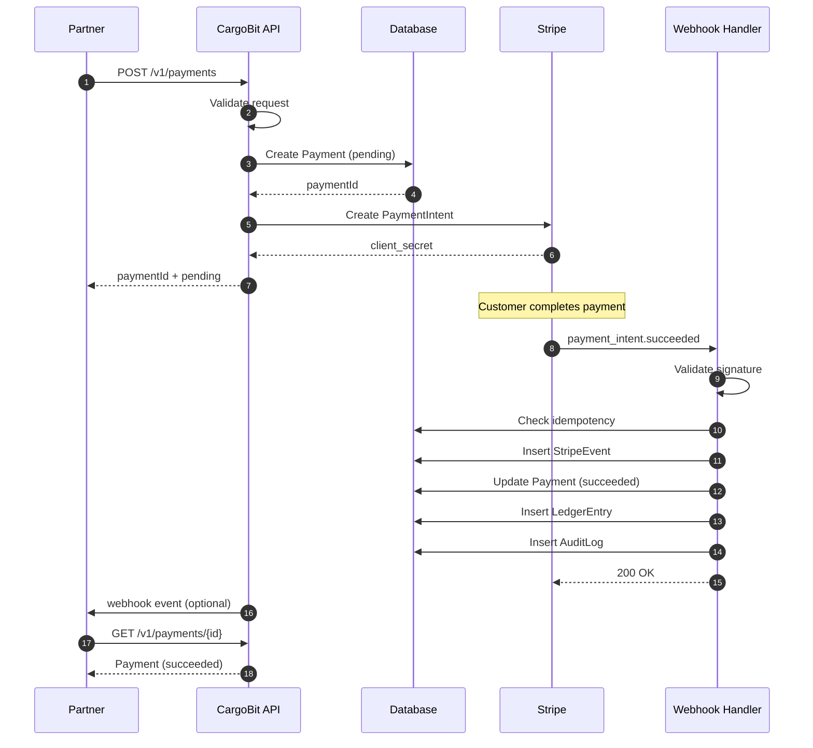
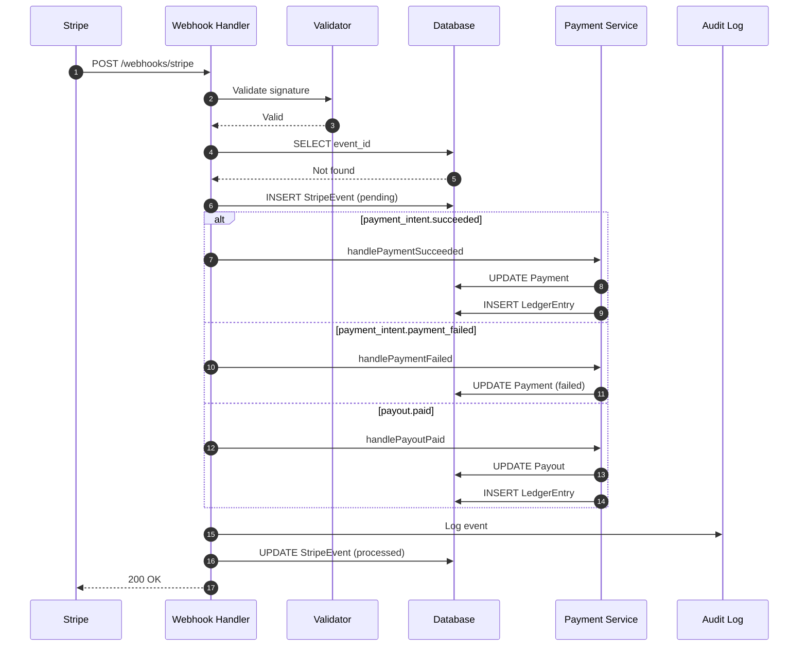
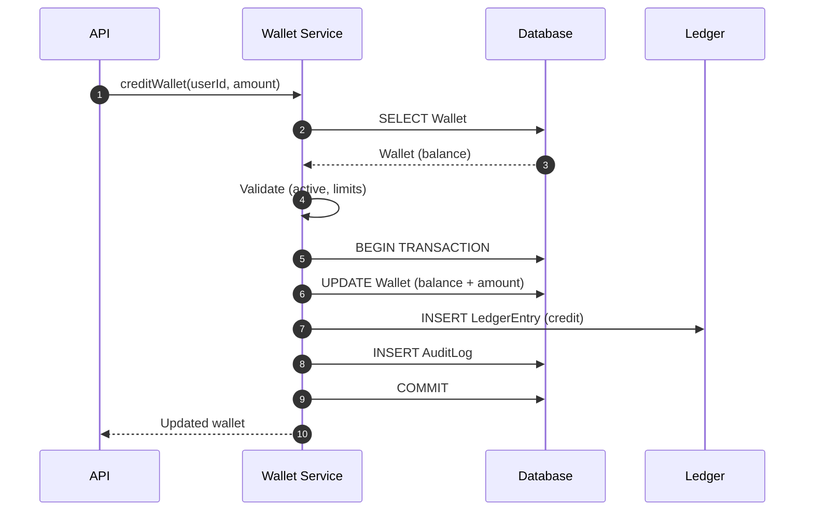
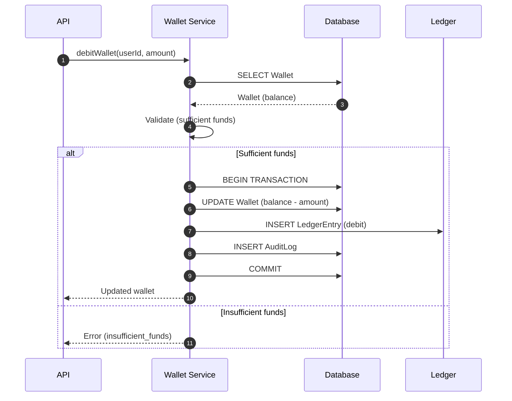
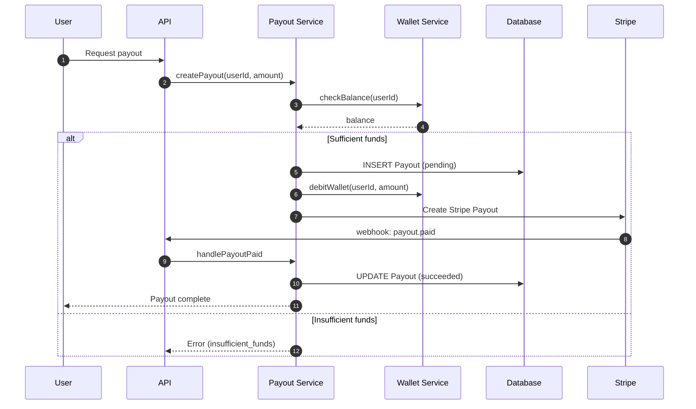
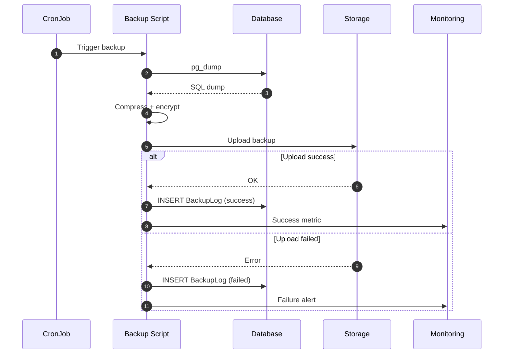
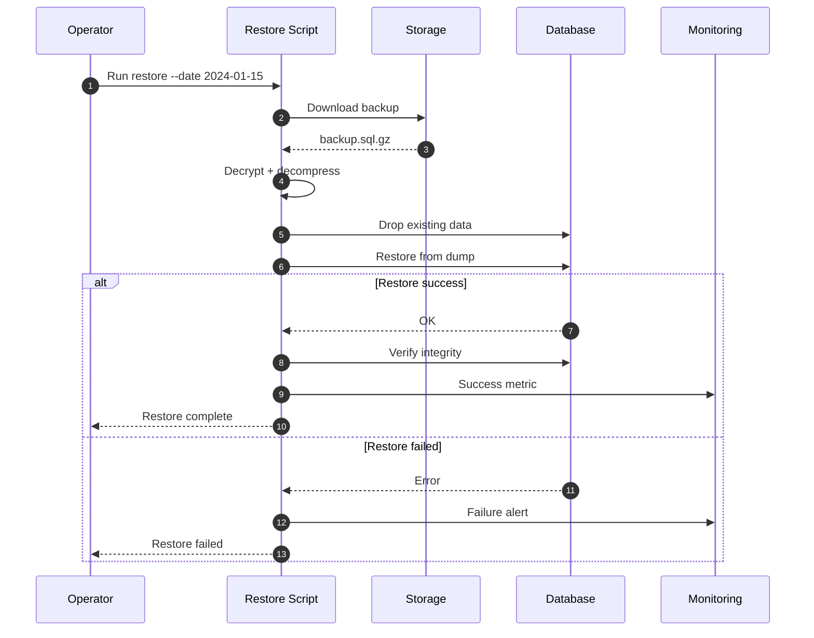
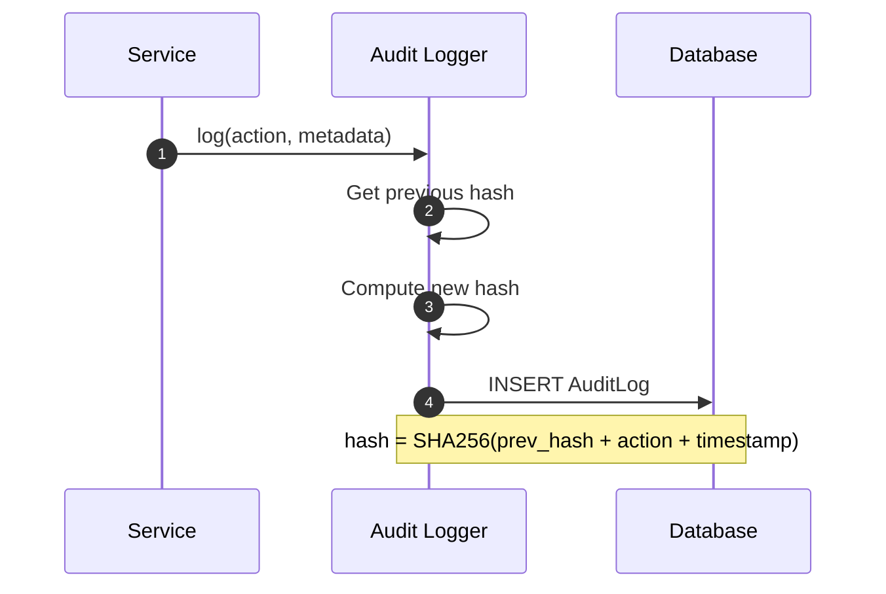
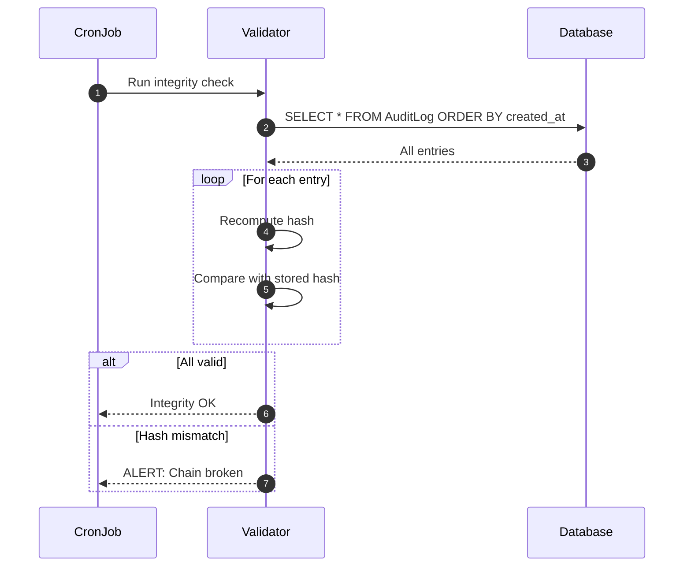

# CargoBit Data Flow & Sequence Diagrams
Version 1.0
Internal Use Only

---

# 1. Purpose

Dieses Dokument visualisiert alle Datenflüsse und Sequenzen im CargoBit System. Es dient als Referenz für Entwickler, SREs und Partner.

---

# 2. Payment Flow

## 2.1 Sequence Diagram



## 2.2 Data Flow

```
Partner Request
    │
    ▼
┌─────────────┐
│ API Gateway │ ← Rate Limiting, Auth
└─────────────┘
    │
    ▼
┌─────────────┐
│ Payment     │ ← Validation, Business Logic
│ Service     │
└─────────────┘
    │
    ├──────────────────┐
    ▼                  ▼
┌─────────────┐  ┌─────────────┐
│ Database    │  │ Stripe API  │
│ (Payment)   │  │ (PI create) │
└─────────────┘  └─────────────┘
```

---

# 3. Webhook Processing Flow

## 3.1 Sequence Diagram



## 3.2 Data Flow

```
Stripe Webhook
    │
    ▼
┌─────────────────────┐
│ Signature Validator │ ← HMAC-SHA256
└─────────────────────┘
    │
    ▼
┌─────────────────────┐
│ Idempotency Check   │ ← StripeEvent table
└─────────────────────┘
    │
    ▼
┌─────────────────────┐
│ Event Router        │ ← Type-based routing
└─────────────────────┘
    │
    ├────────────────┬────────────────┐
    ▼                ▼                ▼
┌─────────┐    ┌─────────┐    ┌─────────┐
│ Payment │    │ Payout  │    │ Account │
│ Handler │    │ Handler │    │ Handler │
└─────────┘    └─────────┘    └─────────┘
    │                │                │
    └────────────────┴────────────────┘
                     │
                     ▼
              ┌─────────────┐
              │ Audit Log   │
              └─────────────┘
```

---

# 4. Wallet Flow

## 4.1 Credit Flow



## 4.2 Debit Flow



---

# 5. Payout Flow

## 5.1 Sequence Diagram



---

# 6. Backup Flow

## 6.1 Sequence Diagram



## 6.2 Data Flow

```
┌─────────────────────────────────────────────────────────────┐
│                      BACKUP FLOW                             │
├─────────────────────────────────────────────────────────────┤
│                                                              │
│   CronJob (00:00 UTC)                                        │
│        │                                                     │
│        ▼                                                     │
│   ┌─────────────┐                                            │
│   │ pg_dump     │ ──► SQL dump                               │
│   └─────────────┘                                            │
│        │                                                     │
│        ▼                                                     │
│   ┌─────────────┐                                            │
│   │ gzip        │ ──► backup.sql.gz                          │
│   └─────────────┘                                            │
│        │                                                     │
│        ▼                                                     │
│   ┌─────────────┐                                            │
│   │ Storage     │ ──► s3://backups/YYYY-MM-DD.sql.gz        │
│   └─────────────┘                                            │
│        │                                                     │
│        ▼                                                     │
│   ┌─────────────┐                                            │
│   │ Monitoring  │ ──► Success/Failure alert                  │
│   └─────────────┘                                            │
│                                                              │
└─────────────────────────────────────────────────────────────┘
```

---

# 7. Restore Flow

## 7.1 Sequence Diagram



---

# 8. Audit Log Flow

## 8.1 Write Flow



## 8.2 Integrity Check Flow



---

# 9. Rate Limiting Flow

## 9.1 Token Bucket Algorithm

```
┌─────────────────────────────────────────────────────────────┐
│                    RATE LIMITING FLOW                        │
├─────────────────────────────────────────────────────────────┤
│                                                              │
│   Request                                                    │
│      │                                                       │
│      ▼                                                       │
│   ┌─────────────┐                                            │
│   │ Extract     │ ──► API Key / IP                          │
│   │ Identifier  │                                            │
│   └─────────────┘                                            │
│      │                                                       │
│      ▼                                                       │
│   ┌─────────────┐                                            │
│   │ Redis       │ ──► GET tokens                            │
│   │ Token Bucket│                                            │
│   └─────────────┘                                            │
│      │                                                       │
│      ├──────────────────────┐                                │
│      ▼                      ▼                                │
│   tokens > 0             tokens = 0                          │
│      │                      │                                │
│      ▼                      ▼                                │
│   ┌─────────┐          ┌─────────┐                           │
│   │ DECR    │          │ REJECT  │                           │
│   │ tokens  │          │ 429     │                           │
│   └─────────┘          └─────────┘                           │
│      │                                                       │
│      ▼                                                       │
│   Process Request                                            │
│                                                              │
└─────────────────────────────────────────────────────────────┘
```

---

# 10. System Overview

## 10.1 High-Level Architecture

```
┌─────────────────────────────────────────────────────────────────────────┐
│                         CARGOBIT SYSTEM OVERVIEW                         │
├─────────────────────────────────────────────────────────────────────────┤
│                                                                          │
│   ┌────────────┐     ┌────────────┐     ┌────────────┐                  │
│   │  Partners  │     │  Users     │     │  Admin     │                  │
│   └────────────┘     └────────────┘     └────────────┘                  │
│        │                  │                  │                           │
│        └──────────────────┴──────────────────┘                           │
│                           │                                              │
│                           ▼                                              │
│                    ┌─────────────┐                                       │
│                    │ API Gateway │                                       │
│                    │ (Rate Limit)│                                       │
│                    └─────────────┘                                       │
│                           │                                              │
│        ┌──────────────────┼──────────────────┐                          │
│        ▼                  ▼                  ▼                          │
│   ┌─────────┐       ┌─────────┐       ┌─────────┐                       │
│   │ Payment │       │ Wallet  │       │ Payout  │                       │
│   │ Service │       │ Service │       │ Service │                       │
│   └─────────┘       └─────────┘       └─────────┘                       │
│        │                  │                  │                           │
│        └──────────────────┼──────────────────┘                           │
│                           │                                              │
│        ┌──────────────────┼──────────────────┐                          │
│        ▼                  ▼                  ▼                          │
│   ┌─────────┐       ┌─────────┐       ┌─────────┐                       │
│   │ Ledger  │       │AuditLog │       │StripeEvent│                      │
│   │ Table   │       │ Table   │       │  Table   │                       │
│   └─────────┘       └─────────┘       └─────────┘                       │
│                                                                          │
│   External:              Operations:                                     │
│   ┌─────────┐           ┌─────────┐                                      │
│   │ Stripe  │           │ Backups │                                      │
│   │   API   │           │ CronJobs│                                      │
│   └─────────┘           └─────────┘                                      │
│                                                                          │
└─────────────────────────────────────────────────────────────────────────┘
```

---

# 11. Summary

Dieses Dokument visualisiert alle kritischen Datenflüsse im CargoBit System. Es dient als Referenz für Entwicklung, Debugging und Onboarding.

---

# 12. Contact

Architecture Board
CargoBit Internal
