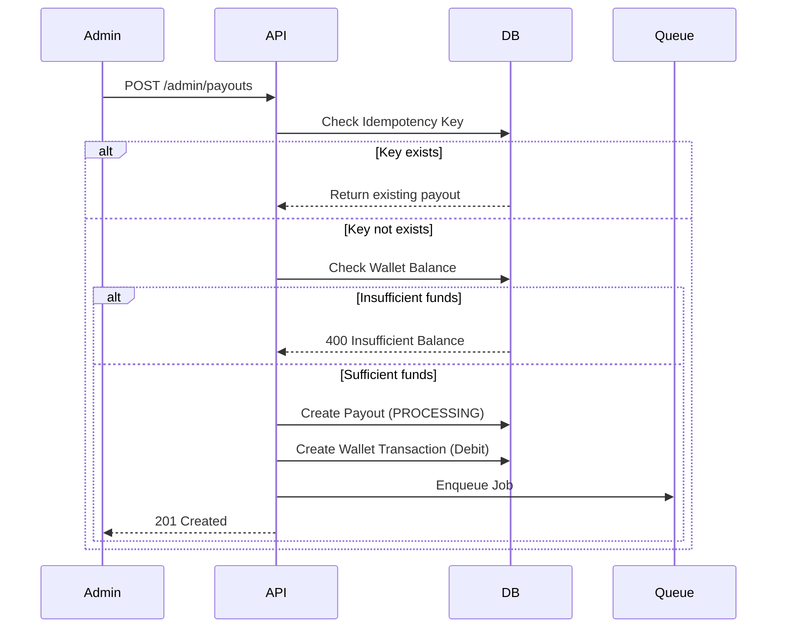
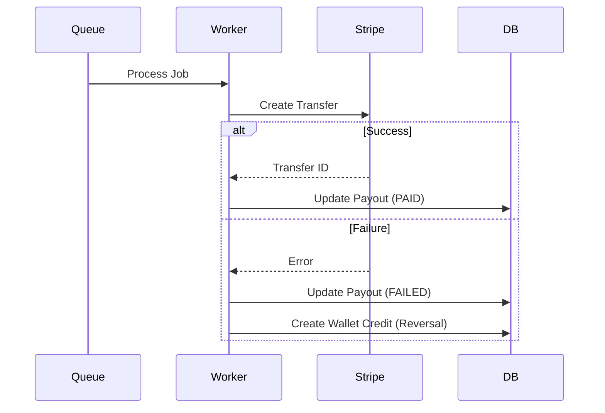
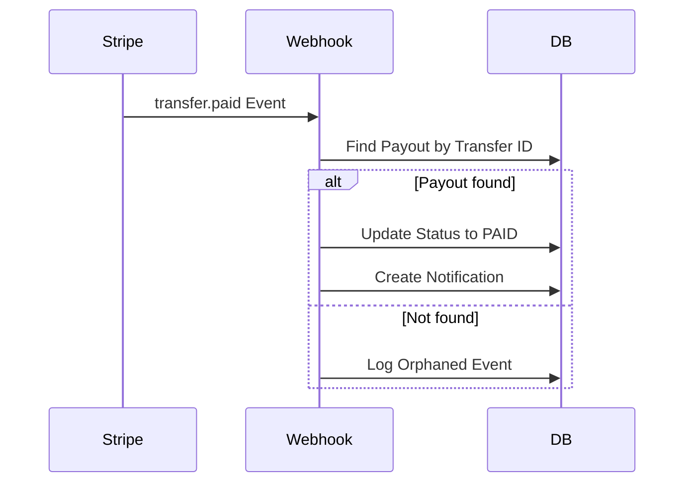

# CargoBit Payouts Runbook

## Übersicht

Das CargoBit Payouts System verwaltet die Auszahlungen an Nutzer über Stripe Transfers. Dieses Dokument beschreibt die Betriebsprozeduren, Monitoring und Fehlerbehebung.

## Architektur

```
┌─────────────────┐     ┌─────────────────┐     ┌─────────────────┐
│   Admin API     │────▶│  BullMQ Queue   │────▶│  Payout Worker  │
│ /admin/payouts  │     │    (Redis)      │     │   (Stripe)      │
└─────────────────┘     └─────────────────┘     └─────────────────┘
         │                                              │
         ▼                                              ▼
┌─────────────────┐                           ┌─────────────────┐
│    Prisma DB    │                           │ Stripe Webhook  │
│   (SQLite/PG)   │◀──────────────────────────│   Handler       │
└─────────────────┘                           └─────────────────┘
         │
         ▼
┌─────────────────┐     ┌─────────────────┐
│    Scheduler    │────▶│ Reconciliation  │
│  (Daily Cron)   │     │     Job         │
└─────────────────┘     └─────────────────┘
```

## Komponenten

### 1. API Routes

| Route | Methode | Beschreibung |
|-------|---------|--------------|
| `/api/admin/payouts` | GET | Liste aller Auszahlungen |
| `/api/admin/payouts` | POST | Neue Auszahlung erstellen |
| `/api/admin/payouts/[id]` | GET | Details einer Auszahlung |
| `/api/admin/payouts/[id]` | DELETE | Auszahlung stornieren |
| `/api/admin/payouts/[id]/retry` | POST | Fehlgeschlagene Auszahlung wiederholen |
| `/api/stripe/webhook/payouts` | POST | Stripe Webhook Handler |
| `/api/cron/payouts` | POST | Scheduler Trigger |
| `/api/metrics/payouts` | GET | Prometheus Metrics |

### 2. Services

| Service | Datei | Beschreibung |
|---------|-------|--------------|
| PayoutWorkerService | `payout-worker.service.ts` | Verarbeitet Stripe Transfers |
| PayoutQueueService | `payout-queue.service.ts` | BullMQ Queue Management |
| PayoutSchedulerService | `payout-scheduler.service.ts` | Daily Reconciliation |
| LeaderLockService | `leader-lock.service.ts` | Distributed Locking |
| PayoutMetricsService | `payout-metrics.service.ts` | Observability |

### 3. Database Models

```
Payout
├── id: String (CUID)
├── userId: String
├── amountCents: Int
├── currency: String
├── status: PayoutStatus (PENDING, PROCESSING, PAID, FAILED, CANCELLED)
├── stripeTransferId: String?
├── failureReason: String?
├── retryCount: Int
├── idempotencyKey: String? (unique)
└── payoutAttempts: PayoutAttempt[]

PayoutAttempt
├── id: String
├── payoutId: String
├── status: String
├── stripeResponse: String? (JSON)
└── error: String?

PayoutEvent
├── id: String
├── type: String
├── payload: String? (JSON)
└── processed: Boolean
```

## Payout Flow

### 1. Erstellung



### 2. Verarbeitung (Worker)



### 3. Webhook Handling



## Monitoring

### Prometheus Metrics

```
# Counters
cargobit_payouts_created_total
cargobit_payouts_paid_total
cargobit_payouts_failed_total

# Gauges
cargobit_payouts_pending_count
cargobit_payouts_processing_count
cargobit_payouts_failed_count
cargobit_payout_average_processing_time_ms
cargobit_payout_queue_waiting_count

# Reconciliation
cargobit_payout_reconciliation_diffs_count
```

### Health Endpoints

| Endpoint | Zweck |
|----------|-------|
| `/api/health` | Application Health |
| `/api/cron/payouts` (GET) | Scheduler Health |
| `/api/metrics/payouts` | Metrics Export |

### Alerting Rules

```yaml
# Prometheus Alert Rules
groups:
  - name: payouts
    rules:
      - alert: HighPayoutFailureRate
        expr: rate(cargobit_payouts_failed_total[1h]) > 0.1
        for: 5m
        labels:
          severity: warning
        annotations:
          summary: "High payout failure rate"

      - alert: StuckPayouts
        expr: cargobit_payouts_processing_count > 10
        for: 30m
        labels:
          severity: warning
        annotations:
          summary: "Payouts stuck in PROCESSING state"

      - alert: ReconciliationIssues
        expr: cargobit_payout_reconciliation_diffs_count > 0
        for: 10m
        labels:
          severity: warning
        annotations:
          summary: "Reconciliation found discrepancies"
```

## Fehlerbehebung

### 1. Payout stuck in PROCESSING

**Symptom:** Payout bleibt länger als 24h in PROCESSING

**Diagnose:**
```bash
# Check payout attempts
curl -X GET "http://localhost:3000/api/admin/payouts/{id}" \
  -H "Authorization: Bearer {token}"
```

**Lösung:**
1. Prüfe Stripe Transfer ID
2. Wenn kein Transfer ID: Worker fehlgeschlagen
3. Manuelles Retry über `/api/admin/payouts/{id}/retry`

### 2. Fehlgeschlagene Auszahlung

**Symptom:** Payout Status ist FAILED

**Diagnose:**
```sql
-- Check failure reason
SELECT id, failure_reason, retry_count, last_retry_at
FROM payouts
WHERE status = 'FAILED'
ORDER BY updated_at DESC;
```

**Lösung:**
1. Prüfe `failure_reason`
2. Behebe Grundursache (z.B. Stripe Account Problem)
3. Retry über API: `POST /api/admin/payouts/{id}/retry`
4. Max 3 Retries möglich

### 3. Wallet Balance Inkonsistenz

**Symptom:** Wallet Balance stimmt nicht mit Transaktionen überein

**Diagnose:**
```sql
-- Check wallet transactions
SELECT 
  w.id as wallet_id,
  w.balance,
  COALESCE(SUM(wt.amount), 0) as calculated_balance
FROM wallets w
LEFT JOIN wallet_transactions wt ON w.id = wt.wallet_id
GROUP BY w.id
HAVING w.balance != COALESCE(SUM(wt.amount), 0);
```

**Lösung:**
1. Reconciliation Job läuft täglich
2. Manuelles Trigger: `POST /api/cron/payouts`
3. Auto-Reversal wird erstellt

### 4. Webhook Events nicht verarbeitet

**Symptom:** Stripe Events werden nicht verarbeitet

**Diagnose:**
```sql
-- Check unprocessed events
SELECT * FROM payout_events
WHERE processed = false
ORDER BY received_at DESC;
```

**Lösung:**
1. Prüfe Stripe Webhook Secret
2. Verifiziere Signature
3. Replays über Stripe Dashboard

## Wartung

### Daily Tasks

- [ ] Prüfe Scheduler Health
- [ ] Überprüfe Reconciliation Results
- [ ] Prüfe Failed Payouts Queue

### Weekly Tasks

- [ ] Cleanup alte Payout Events (> 90 Tage)
- [ ] Review Metrics Trends
- [ ] Update Alert Thresholds

### Monthly Tasks

- [ ] Audit Payout Logs
- [ ] Review Retry Success Rate
- [ ] Stripe Account Verification

## Environment Variables

```bash
# Required
DATABASE_URL="postgresql://..."
STRIPE_SECRET_KEY="sk_..."
STRIPE_WEBHOOK_SECRET="whsec_..."

# Optional
REDIS_HOST="localhost"
REDIS_PORT="6379"
REDIS_PASSWORD=""
DEFAULT_STRIPE_ACCOUNT_ID="acct_..."
CRON_SECRET="your-cron-secret"
HOSTNAME="payout-worker-1"
```

## Deployment

### Vercel / Serverless

```bash
# Environment Variables setzen
vercel env add STRIPE_SECRET_KEY
vercel env add STRIPE_WEBHOOK_SECRET
vercel env add CRON_SECRET

# Cron Job konfigurieren (vercel.json)
{
  "crons": [{
    "path": "/api/cron/payouts",
    "schedule": "0 0 * * *"
  }]
}
```

### Docker / Kubernetes

```yaml
# Worker Deployment
apiVersion: apps/v1
kind: Deployment
metadata:
  name: payout-worker
spec:
  replicas: 2
  template:
    spec:
      containers:
        - name: worker
          image: cargobit/payout-worker:latest
          env:
            - name: REDIS_HOST
              value: "redis-service"
            - name: DATABASE_URL
              valueFrom:
                secretKeyRef:
                  name: cargobit-secrets
                  key: database-url
```

## Support

Bei kritischen Problemen:

1. Prüfe Health Endpoints
2. Review Logs in Monitoring
3. Kontakt: support@cargobit.example.com
