# CargoBit ER-Diagramm - Mermaid Code

## Für dbdiagram.io oder mermaid.live

```mermaid
erDiagram
    %% ==========================================
    %% USERS & ROLES
    %% ==========================================
    USERS ||--o{ USER_ROLES : "hat"
    ROLES ||--o{ USER_ROLES : "enthält"
    USER_ROLES }|--|| USERS : "user_id FK"
    USER_ROLES }|--|| ROLES : "role_id FK"
    
    USERS {
        string id PK
        string email UK
        string password_hash
        string first_name
        string last_name
        string phone
        string language
        string status "active/pending/blocked"
        datetime created_at
        datetime updated_at
    }
    
    ROLES {
        string id PK
        string name "ADMIN/SUPPORT/SHIPPER..."
    }
    
    USER_ROLES {
        string user_id FK
        string role_id FK
    }
    
    %% ==========================================
    %% COMPANIES
    %% ==========================================
    COMPANIES ||--o{ COMPANY_USERS : "hat Mitglieder"
    USERS ||--o{ COMPANY_USERS : "gehört zu"
    COMPANIES ||--o{ VEHICLES : "besitzt"
    COMPANIES ||--o{ DRIVERS : "beschäftigt"
    COMPANIES ||--o{ CAMPAIGNS : "startet"
    
    COMPANIES {
        string id PK
        string name
        string type "shipper/carrier/both"
        string vat_number UK
        string registration_number
        string country
        string status
        datetime created_at
    }
    
    COMPANY_USERS {
        string company_id FK
        string user_id FK
        string role_in_company "owner/admin/member"
    }
    
    %% ==========================================
    %% VERIFICATION & SECURITY
    %% ==========================================
    USERS ||--o{ VERIFICATIONS : "verifiziert"
    USERS ||--o{ SECURITY_FLAGS : "hat Flags"
    
    VERIFICATIONS {
        string id PK
        string user_id FK
        string type "KYC/KYB/ADR/LICENSE"
        string status "pending/approved/rejected"
        string document_url
        string reviewed_by FK
        datetime reviewed_at
        datetime created_at
    }
    
    SECURITY_FLAGS {
        string id PK
        string user_id FK
        string type "fraud/payment_issue/..."
        string severity "low/medium/high/critical"
        boolean active
        string notes
        datetime created_at
    }
    
    %% ==========================================
    %% VEHICLES & DRIVERS
    %% ==========================================
    DRIVERS ||--o{ DRIVER_VEHICLES : "fährt"
    VEHICLES ||--o{ DRIVER_VEHICLES : "genutzt von"
    DRIVERS ||--o{ DRIVER_PERMISSIONS : "hat Genehmigungen"
    
    VEHICLES {
        string id PK
        string company_id FK
        string type "sprinter/koffer/curtainsider..."
        string plate_number UK
        float max_payload_kg
        float volume_m3
        float length_m
        float width_m
        float height_m
        boolean adr_approved
        boolean cooling_available
        string status "active/maintenance/inactive"
    }
    
    DRIVERS {
        string id PK
        string user_id FK "unique"
        string company_id FK "nullable"
        string license_number
        boolean adr_license
        boolean international_experience
        float rating_avg
        int rating_count
    }
    
    DRIVER_VEHICLES {
        string driver_id FK
        string vehicle_id FK
        boolean is_primary
    }
    
    %% ==========================================
    %% TRANSPORTS
    %% ==========================================
    USERS ||--o{ TRANSPORTS : "versendet"
    ADDRESSES ||--o{ TRANSPORTS : "pickup"
    ADDRESSES ||--o{ TRANSPORTS : "delivery"
    TRANSPORTS ||--|| TRANSPORT_DETAILS : "hat Details"
    TRANSPORTS ||--o{ MATCHING_SESSIONS : "matched"
    TRANSPORTS ||--o{ OFFERS : "erhält"
    TRANSPORTS ||--o| ASSIGNMENTS : "zugewiesen"
    TRANSPORTS ||--o{ TRANSPORT_STATUS_HISTORY : "trackt"
    TRANSPORTS ||--o{ TRACKING_POINTS : "GPS"
    TRANSPORTS ||--o{ DOCUMENTS : "hat Docs"
    TRANSPORTS ||--o{ COMMISSIONS : "generiert"
    
    TRANSPORTS {
        string id PK
        string shipper_user_id FK
        string shipper_company_id FK
        string transport_type "pallet/bulk/cooling..."
        string status "created/assigned/in_transit/..."
        string pickup_address_id FK
        string delivery_address_id FK
        datetime pickup_datetime
        datetime delivery_datetime
        string description
        datetime created_at
    }
    
    TRANSPORT_DETAILS {
        string id PK
        string transport_id FK "unique"
        string details_json
        string vehicle_requirements
        string driver_requirements
    }
    
    ADDRESSES {
        string id PK
        string company_id FK "optional"
        string label
        string street
        string zip
        string city
        string country
        float lat
        float lng
    }
    
    %% ==========================================
    %% MATCHING
    %% ==========================================
    MATCHING_SESSIONS ||--o{ MATCHING_CANDIDATES : "enthält"
    DRIVERS ||--o{ MATCHING_CANDIDATES : "kandidiert"
    VEHICLES ||--o{ MATCHING_CANDIDATES : "angeboten"
    
    MATCHING_SESSIONS {
        string id PK
        string transport_id FK
        string status "started/running/completed/stopped"
        boolean auto_assign
        datetime created_at
        datetime updated_at
    }
    
    MATCHING_CANDIDATES {
        string id PK
        string matching_session_id FK
        string driver_id FK
        string vehicle_id FK
        boolean hard_filter_passed
        boolean soft_rules_passed
        boolean fraud_safe
        boolean international_allowed
        float score "0-100"
    }
    
    OFFERS {
        string id PK
        string transport_id FK
        string driver_id FK
        string vehicle_id FK
        float price
        string currency
        string status "pending/accepted/rejected"
        datetime created_at
    }
    
    ASSIGNMENTS {
        string id PK
        string transport_id FK "unique"
        string driver_id FK
        string vehicle_id FK
        string assigned_by FK
        datetime assigned_at
    }
    
    %% ==========================================
    %% TRACKING
    %% ==========================================
    TRANSPORT_STATUS_HISTORY {
        string id PK
        string transport_id FK
        string status
        string changed_by FK
        datetime changed_at
    }
    
    TRACKING_POINTS {
        string id PK
        string transport_id FK
        string driver_id FK
        float lat
        float lng
        datetime timestamp
        float speed
        float heading
    }
    
    DOCUMENTS {
        string id PK
        string transport_id FK
        string type "cmr/lieferschein/rechnung/..."
        string file_url
        int file_size
        string created_by FK
        boolean is_signed
        datetime signed_at
    }
    
    %% ==========================================
    %% WALLET
    %% ==========================================
    USERS ||--o| WALLETS : "besitzt"
    COMPANIES ||--o{ WALLETS : "besitzt"
    WALLETS ||--o{ WALLET_TRANSACTIONS : "hat"
    WALLETS ||--o{ PAYOUT_METHODS : "konfiguriert"
    
    WALLETS {
        string id PK
        string owner_user_id FK "unique"
        string owner_company_id FK
        float balance
        string currency
        string status "active/frozen"
    }
    
    WALLET_TRANSACTIONS {
        string id PK
        string wallet_id FK
        string type "deposit/payout/fee/commission"
        float amount
        string currency
        string related_transport_id FK
        datetime created_at
    }
    
    PAYOUT_METHODS {
        string id PK
        string wallet_id FK
        string iban
        string holder_name
        boolean verified
    }
    
    COMMISSIONS {
        string id PK
        string transport_id FK
        string plan "free/starter/pro/enterprise"
        float commission_percent
        float commission_amount
        float wallet_fee_percent
        float wallet_fee_amount
    }
    
    %% ==========================================
    %% PLANS & MARKETING
    %% ==========================================
    PLANS ||--o{ COMPANY_PLANS : "abonniert"
    COMPANIES ||--o{ COMPANY_PLANS : "nutzt"
    CAMPAIGNS ||--o{ CAMPAIGN_STATS : "trackt"
    
    PLANS {
        string id PK
        string name "FREE/STARTER/PRO/ENTERPRISE"
        float monthly_fee
        float yearly_fee
        float commission_percent
        float wallet_fee_percent
        string features_json
    }
    
    COMPANY_PLANS {
        string id PK
        string company_id FK
        string plan_id FK
        datetime valid_from
        datetime valid_to
    }
    
    CAMPAIGNS {
        string id PK
        string company_id FK
        string name
        string position "banner_top/sidebar/highlight"
        float budget
        string status
        datetime start_date
        datetime end_date
    }
    
    CAMPAIGN_STATS {
        string id PK
        string campaign_id FK
        datetime date
        int impressions
        int clicks
        int conversions
    }
    
    %% ==========================================
    %% SUPPORT
    %% ==========================================
    USERS ||--o{ SUPPORT_TICKETS : "öffnet"
    SUPPORT_TICKETS ||--o{ SUPPORT_MESSAGES : "enthält"
    
    SUPPORT_TICKETS {
        string id PK
        string user_id FK
        string transport_id FK
        string subject
        string status "open/in_progress/resolved/closed"
        string priority
        string category
        datetime created_at
    }
    
    SUPPORT_MESSAGES {
        string id PK
        string ticket_id FK
        string sender_user_id FK
        string message
        string attachments
        datetime created_at
    }
    
    %% ==========================================
    %% AUDIT
    %% ==========================================
    USERS ||--o{ AUDIT_LOGS : "führt aus"
    
    AUDIT_LOGS {
        string id PK
        string entity_type
        string entity_id
        string action "create/update/delete/status_change"
        string performed_by FK
        string data_before
        string data_after
        datetime created_at
    }
    
    %% ==========================================
    %% INTERNATIONAL
    %% ==========================================
    DRIVERS ||--o{ DRIVER_PERMISSIONS : "hat"
    
    DRIVER_PERMISSIONS {
        string id PK
        string driver_id FK
        string country_code "ISO 2-letter"
        string country_name
        boolean is_allowed
        boolean visa_required
        boolean visa_valid
        int trips_completed
        datetime last_trip_at
    }
    
    TOLL_SYSTEMS {
        string id PK
        string country_code
        string country_name
        string system_name "Toll Collect/eToll/myto"
        string system_type "distance/vignette/hybrid"
        float euro5_rate
        float euro6_rate
        float vignette_daily
        float vignette_weekly
        float vignette_monthly
    }
    
    BORDER_CROSSINGS {
        string id PK
        string from_country
        string to_country
        string crossing_name
        boolean adr_allowed
        string tunnel_code
        boolean open24h
        int avg_wait_minutes
        boolean customs_required
        string customs_type "EU_INTERNAL/EU_EXTERNAL"
    }
```

## Beziehungen Übersicht

### 1:1 Beziehungen
- `transports` ⟷ `transport_details`
- `transports` ⟷ `assignments`
- `users` ⟷ `wallets`
- `drivers` ⟷ `users`

### 1:n Beziehungen
- `company` → `vehicles`
- `company` → `drivers`
- `transport` → `offers`
- `transport` → `status_history`
- `transport` → `tracking_points`
- `wallet` → `transactions`
- `campaign` → `campaign_stats`

### n:m Beziehungen (via Junction Tables)
- `users` ↔ `roles` (via `user_roles`)
- `companies` ↔ `users` (via `company_users`)
- `drivers` ↔ `vehicles` (via `driver_vehicles`)
