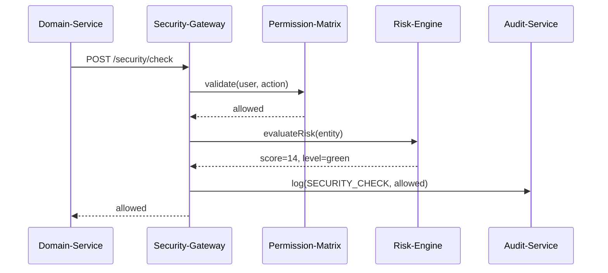
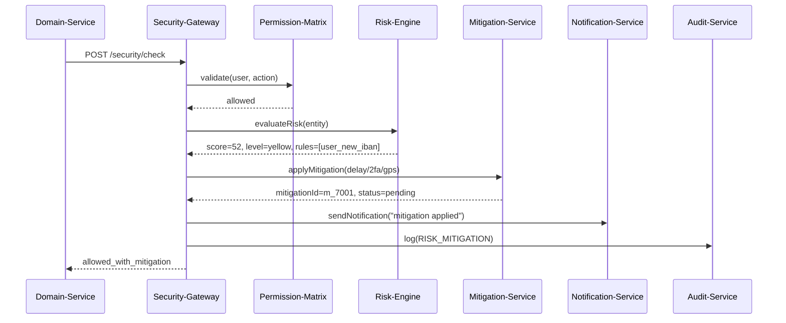
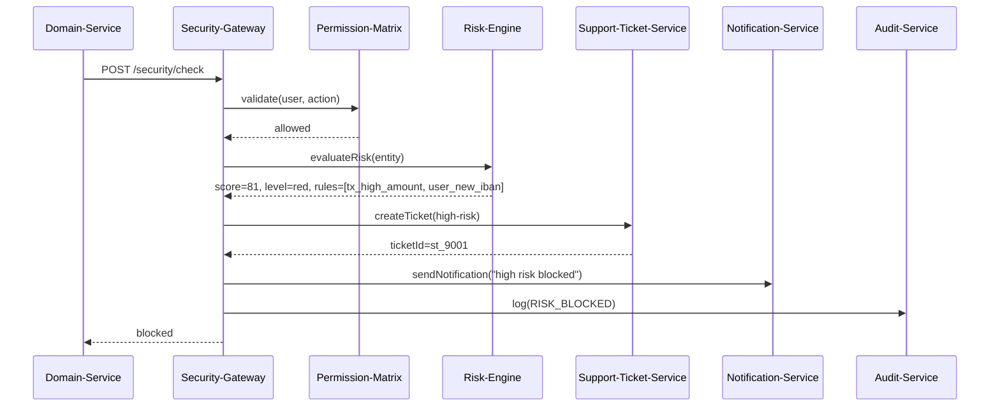
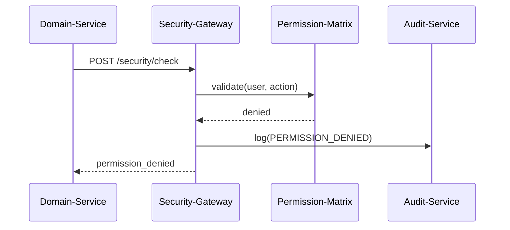
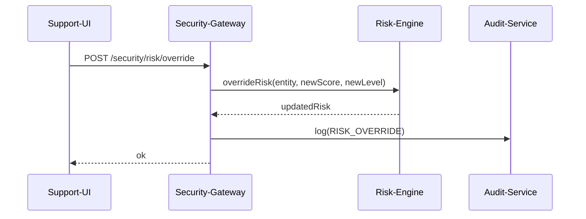

# CargoBit Security-Gateway Sequence Diagrams

> Enterprise-ready Mermaid diagrams for Figma, GitHub/GitLab, Confluence, Notion

---

## 🟩 1. GREEN Flow – Aktion erlaubt (Low Risk)



**Flow Details:**
- **User:** u_1001 (SHIPPER_COMPANY)
- **Action:** ACCEPT_OFFER
- **Entity:** tx_3001 (transaction, 1200 EUR)
- **Risk Score:** 14 (GREEN)
- **Decision:** allowed
- **No Mitigations**

---

## 🟨 2. YELLOW Flow – Mitigation (Delay / 2FA / GPS)



**Flow Details:**
- **User:** u_1002 (SHIPPER_COMPANY)
- **Action:** INITIATE_PAYOUT
- **Entity:** tx_3002 (transaction, 18000 EUR)
- **Risk Score:** 52 (YELLOW)
- **Triggered Rules:** user_new_iban
- **Mitigations:** delay (1440 min), extra_logging
- **Decision:** allowed_with_mitigation

---

## 🟥 3. RED Flow – Aktion blockiert (High Risk)



**Flow Details:**
- **User:** u_1003 (SHIPPER_COMPANY)
- **Action:** ACCEPT_OFFER
- **Entity:** tx_3003 (transaction, 52000 EUR, international)
- **Risk Score:** 81 (RED)
- **Triggered Rules:** tx_high_amount, user_new_iban, company_kyb_missing
- **Support Ticket:** st_9001 (CRITICAL)
- **Decision:** blocked
- **Notification Channels:** SLACK + EMAIL

---

## 🧩 4. Permission Denied Flow (ohne Risk-Engine)



**Flow Details:**
- **User:** u_driver (DRIVER_SELF_EMPLOYED)
- **Action:** INITIATE_PAYOUT
- **Decision:** permission_denied
- **No Risk-Engine Call**
- **No Mitigation Call**
- **No Notification Call**

---

## 🧑‍💼 5. Support Override Flow (Risk Override)



**Flow Details:**
- **Actor:** support-001 (SUPPORT role)
- **Entity:** u_1003 (user)
- **Old Risk:** score=81, level=red
- **New Risk:** score=15, level=green
- **Reason:** "Manual verification completed via video call"
- **Next Check:** Uses overridden score

---

## API Endpoints Summary

| Endpoint | Method | Purpose |
|----------|--------|---------|
| `/api/security/check` | POST | Core Hybrid Security Check |
| `/api/security/permissions/validate` | POST | Quick Permission Check |
| `/api/security/risk/override` | POST | Manual Risk Override (Support/Admin) |
| `/api/security/mitigation/apply` | POST | Trigger Mitigation Service |
| `/api/security/risk/{entityType}/{entityId}` | GET | Get Risk Status |

---

## Risk Level Thresholds

| Level | Score Range | Decision |
|-------|-------------|----------|
| 🟩 GREEN | 0-30 | `allowed` |
| 🟨 YELLOW | 31-60 | `allowed_with_mitigation` |
| 🟥 RED | 61-100 | `blocked` |

---

## Test Entity IDs

| Type | IDs |
|------|-----|
| Users | u_1001, u_1002, u_1003, u_1004 |
| Companies | c_2001, c_2002, c_2003 |
| Transactions | tx_3001, tx_3002, tx_3003 |
| Mitigations | m_7001, m_7002 |
| Support Tickets | st_9001 |

---

## Usage in Tools

### Figma
1. Install Mermaid Plugin
2. Copy diagram code
3. Paste into plugin

### GitHub/GitLab
1. Use ```mermaid code blocks
2. Renders automatically in Markdown

### Confluence
1. Use Mermaid macro
2. Paste diagram code

### Notion
1. Use Mermaid code block
2. Third-party integrations available

---

*Generated: 2026-04-15*
*Version: 2.0.0*
