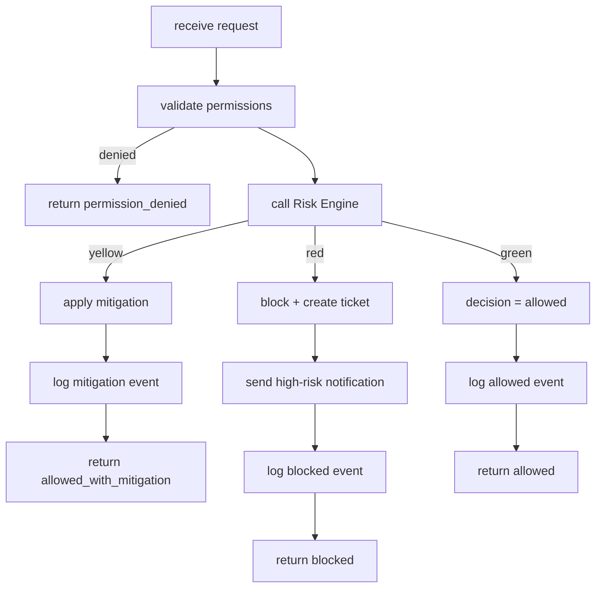

# CargoBit Security Layer - C4 Architecture Documentation

## Übersicht

Dieses Dokument enthält die vollständige C4-Architektur für den CargoBit Security-Layer. Die Diagramme sind in Mermaid-Notation verfasst und können direkt in GitHub, GitLab, Confluence, Notion oder Figma verwendet werden.

---

## 🧱 C4-Level 1 — System Context Diagram

Zeigt, wie der Security-Gateway mit allen externen Systemen interagiert.

```mermaid
C4Context
    title Security Layer - System Context

    Person(user, "End User", "Interacts with domain services")
    System(domain, "Domain Services", "Transport, Wallet, User, Company")
    System_Boundary(security, "Security Layer") {
        System(gateway, "Security Gateway", "Hybrid Permission + Risk + Mitigation")
        System(risk, "Risk Engine", "Risk scoring and rule evaluation")
        System(mitigation, "Mitigation Service", "Delay, 2FA, GPS checks")
        System(audit, "Audit Service", "Stores all security events")
        System(notification, "Notification Service", "Slack, Email, SMS alerts")
        System(ticket, "Support Ticket Service", "Handles high-risk cases")
    }

    user --> domain : Uses
    domain --> gateway : /security/check
    gateway --> risk : Evaluate risk
    gateway --> mitigation : Apply mitigation
    gateway --> audit : Log event
    gateway --> notification : Send alerts
    gateway --> ticket : Create high-risk ticket
```

### Beschreibung der Systeme

| System | Verantwortlichkeit | Technologie |
|--------|-------------------|-------------|
| **Security Gateway** | Hybrid Permission + Risk + Mitigation | Node.js / Bun |
| **Risk Engine** | Risk Scoring und Regel-Evaluation | TypeScript |
| **Mitigation Service** | Delay, 2FA, GPS-Verifizierung | TypeScript |
| **Audit Service** | Speichert alle Security-Events | TypeScript + PostgreSQL |
| **Notification Service** | Slack, Email, SMS Alerts | TypeScript |
| **Support Ticket Service** | High-Risk Case Management | TypeScript |

---

## 🧱 C4-Level 2 — Container Diagram

Zeigt die internen Container des Security-Systems.

```mermaid
C4Container
    title Security Layer - Container Diagram

    Container(gateway, "Security Gateway", "Node/Go/Java", "Entry point for all security checks")
    Container(risk, "Risk Engine", "Go/Python", "Risk scoring, rule evaluation, risk history")
    Container(mitigation, "Mitigation Service", "Node/Go", "Delay, 2FA, GPS verification")
    Container(audit, "Audit Service", "Go/Java", "Event logging, search, analytics")
    Container(notification, "Notification Service", "Node", "Slack, Email, SMS delivery")
    Container(ticket, "Support Ticket Service", "SaaS/Internal", "High-risk case management")

    ContainerDb(riskdb, "Risk DB", "PostgreSQL", "Risk scores, rules, events")
    ContainerDb(auditdb, "Audit DB", "PostgreSQL", "Audit logs, entities, sessions")
    ContainerDb(mitdb, "Mitigation DB", "PostgreSQL", "Mitigation events, queue")
    ContainerDb(notifdb, "Notification DB", "PostgreSQL", "Templates, queue, events")

    gateway --> risk : Evaluate risk
    gateway --> mitigation : Apply mitigation
    gateway --> audit : Log event
    gateway --> notification : Send alert
    gateway --> ticket : Create ticket

    risk --> riskdb : Read/Write
    mitigation --> mitdb : Read/Write
    audit --> auditdb : Read/Write
    notification --> notifdb : Read/Write
```

### Container-Details

| Container | Technologie | Port | Datenbank |
|-----------|-------------|------|-----------|
| Security Gateway | Bun/Node.js | 3004 | - |
| Risk Engine | TypeScript | 3003 | risk_db |
| Mitigation Service | TypeScript | 3000 | mitigation_db |
| Audit Service | TypeScript | 3000 | audit_db |
| Notification Service | TypeScript | 3000 | notification_db |

### Datenbank-Schema

```
┌─────────────────────────────────────────────────────────────────┐
│                         PostgreSQL                               │
├─────────────────────────────────────────────────────────────────┤
│ risk_db:                                                        │
│   • risk_scores (entityType, entityId, score, riskLevel)        │
│   • risk_events (ruleName, weight, metadata)                    │
│   • risk_rules (name, condition, weight, active)                │
│   • risk_history (oldScore, newScore, reason)                   │
├─────────────────────────────────────────────────────────────────┤
│ audit_db:                                                       │
│   • audit_logs (actorType, action, decision, riskScore)         │
│   • audit_entities (entityType, entityId, lastSeen)             │
│   • audit_sessions (userId, sessionId, ip, device)              │
├─────────────────────────────────────────────────────────────────┤
│ mitigation_db:                                                  │
│   • mitigation_events (type, status, attempts, expiresAt)       │
│   • mitigation_status (active, entityType, entityId)            │
│   • mitigation_queue (executeAt, callbackAction)                │
│   • mitigation_rules (type, config, conditions)                 │
├─────────────────────────────────────────────────────────────────┤
│ notification_db:                                                │
│   • notification_events (eventType, status, priority)           │
│   • notification_templates (name, subject, body, channels)      │
│   • notification_channels (type, config, active)                │
│   • notification_queue (eventId, retryCount, nextRetry)         │
└─────────────────────────────────────────────────────────────────┘
```

---

## 🧱 C4-Level 3 — Component Diagram

Zeigt die internen Module des Security-Gateways.

```mermaid
C4Component
    title Security Gateway - Component Diagram

    Container(gateway, "Security Gateway", "Node/Go/Java") {
        Component(api, "API Layer", "REST", "Handles incoming /security/* requests")
        Component(permission, "Permission Validator", "Module", "Validates role/action")
        Component(riskclient, "Risk Engine Client", "Module", "Calls Risk Engine")
        Component(mitclient, "Mitigation Client", "Module", "Triggers mitigations")
        Component(auditclient, "Audit Client", "Module", "Writes audit logs")
        Component(notifyclient, "Notification Client", "Module", "Sends alerts")
        Component(ticketclient, "Ticket Client", "Module", "Creates support tickets")
        Component(decision, "Decision Engine", "Module", "Combines permission + risk + mitigation")
    }

    api --> permission : validate(user, action)
    api --> decision : evaluate()
    decision --> riskclient : evaluateRisk()
    decision --> mitclient : applyMitigation()
    decision --> auditclient : logEvent()
    decision --> notifyclient : sendAlert()
    decision --> ticketclient : createTicket()
```

### Komponenten-Beschreibung

| Komponente | Verantwortlichkeit | Implementierung |
|------------|-------------------|-----------------|
| **API Layer** | REST-Endpunkte für `/security/*` | Next.js API Routes |
| **Permission Validator** | Validiert Role/Action gegen Permission Matrix | `securityGatewayService.validatePermission()` |
| **Risk Engine Client** | Ruft Risk Engine auf | `securityGatewayService.evaluateRisk()` |
| **Mitigation Client** | Löst Mitigations aus | `mitigationService.apply()` |
| **Audit Client** | Schreibt Audit-Logs | `auditService.log()` |
| **Notification Client** | Sendet Alerts | `notificationService.send()` |
| **Ticket Client** | Erstellt Support-Tickets | `db.supportTicket.create()` |
| **Decision Engine** | Kombiniert Permission + Risk + Mitigation | `securityGatewayService.checkSecurity()` |

### API-Endpunkte

| Endpoint | Methode | Beschreibung |
|----------|---------|--------------|
| `/api/security/check` | POST | Hybrid Security Check |
| `/api/security/permissions/validate` | POST | Permission-Only Check |
| `/api/security/risk/override` | POST | Risk Override (Support/Admin) |
| `/api/security/mitigation/apply` | POST | Mitigation anwenden |
| `/api/security/risk/{type}/{id}` | GET | Risk-Status abrufen |
| `/api/security/health` | GET | Health Check |
| `/api/security/error-codes` | GET | Error-Code Katalog |

---

## 🧱 C4-Level 4 — Code Diagram

Zeigt die interne Logik des Decision-Engines auf Code-Ebene.



### Decision-Flow Implementierung

```typescript
async function checkSecurity(request: SecurityCheckRequest): Promise<SecurityCheckResponse> {
  // Step 1: Permission Check
  const permissionResult = validatePermission(request.user, request.action);
  if (!permissionResult.allowed) {
    await logEvent({ decision: 'DENIED', errorCode: 'PERMISSION_DENIED' });
    return { allowed: false, decision: 'permission_denied' };
  }

  // Step 2: Risk Evaluation
  const riskResult = await evaluateRisk(request.entity);

  // Step 3: Decision based on risk level
  switch (riskResult.level) {
    case 'red':
      const ticketId = await createSupportTicket(request, riskResult);
      await sendHighRiskNotification(request, riskResult, ticketId);
      await logEvent({ decision: 'BLOCKED', riskScore, ticketId });
      return { allowed: false, decision: 'blocked', supportTicketId: ticketId };

    case 'yellow':
      const mitigations = await applyMitigations(request, riskResult);
      await logEvent({ decision: 'MITIGATION', mitigations });
      return { allowed: true, decision: 'allowed_with_mitigation', mitigations };

    case 'green':
    default:
      await logEvent({ decision: 'ALLOWED' });
      return { allowed: true, decision: 'allowed' };
  }
}
```

### Risk-Score-Berechnung

```typescript
// Combined Risk Score = UserRisk × 0.4 + CompanyRisk × 0.3 + TransactionRisk × 0.3
const combinedScore = 
  userRisk.score * 0.4 + 
  companyRisk.score * 0.3 + 
  transactionRisk.score * 0.3;

// Risk Level Thresholds
if (combinedScore <= 30) return 'green';     // Allowed
if (combinedScore <= 60) return 'yellow';    // Allowed with Mitigation
return 'red';                                 // Blocked
```

---

## Entscheidungsmatrix

| Risk Level | Score | Entscheidung | Aktion |
|------------|-------|--------------|--------|
| 🟢 GREEN | 0-30 | `allowed` | Aktion ausführen |
| 🟡 YELLOW | 31-60 | `allowed_with_mitigation` | Mitigations anwenden |
| 🔴 RED | 61-100 | `blocked` | Support-Ticket erstellen |

---

## Mitigation-Typen

| Typ | Beschreibung | State-Machine |
|-----|--------------|---------------|
| `delay` | Zeitverzögerung (z.B. 24h bei Payouts) | pending → scheduled → executing → completed |
| `2fa` | Zwei-Faktor-Authentifizierung | pending → waiting_for_user → completed |
| `gps_check` | GPS-Verifizierung | pending → waiting_for_user → completed |
| `extra_logging` | Erweitertes Logging | pending → completed (sofort) |
| `amount_limit` | Betragsbegrenzung | pending → completed (sofort) |
| `document_recheck` | Dokumenten-Neuprüfung | pending → waiting_for_user → completed |
| `manual_review` | Manuelle Überprüfung | pending → waiting_for_user → completed |

---

## Error-Codes

| Code | HTTP Status | Beschreibung |
|------|-------------|--------------|
| `PERMISSION_DENIED` | 403 | Rolle nicht berechtigt |
| `HIGH_RISK_BLOCKED` | 403 | High-Risk blockiert |
| `MITIGATION_REQUIRED` | 403 | Mitigation erforderlich |
| `INVALID_REQUEST` | 400 | Ungültiger Request |
| `RATE_LIMIT_EXCEEDED` | 429 | Rate Limit überschritten |
| `UNAUTHORIZED` | 401 | Nicht authentifiziert |

---

## Referenzen

- [Security State Machines](./security-state-machines.md)
- [OpenAPI Specification](./openapi-security-gateway.yaml)
- [Support UX Flows](./support-ux-flows.md)
- [Error Code Catalog](./error-code-catalog.md)
