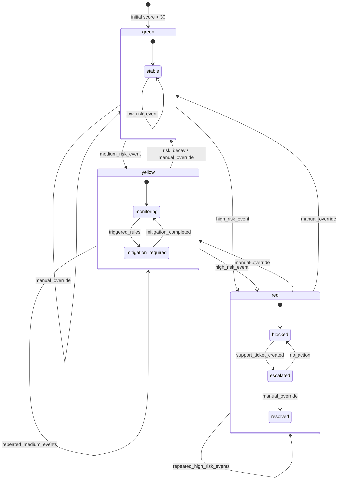
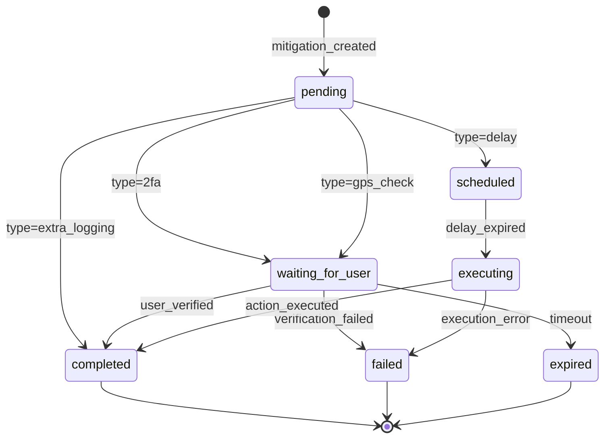
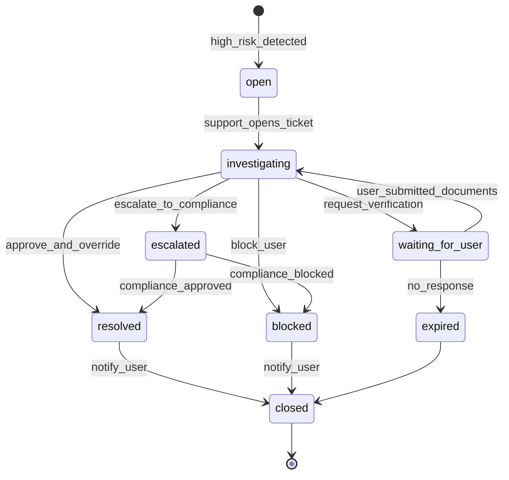

# CargoBit Security State Machines

## Übersicht

Die CargoBit Security-Gateway verwendet drei zentrale State-Machines für die Verwaltung von Risikozuständen, Mitigations und Support-Tickets.

---

## 1. Risk-State-Machine

### Beschreibung
Die Risk-State-Machine verwaltet den vollständigen Lebenszyklus eines Risk-Scores. Sie definiert die Übergänge zwischen den Risikostufen Green, Yellow und Red.

### Mermaid-Diagramm



### Zustände und Unterzustände

| Zustand | Unterzustand | Beschreibung |
|---------|--------------|--------------|
| `green` | `stable` | Normal, stabile Niedrigrisiko-Status |
| `yellow` | `monitoring` | Erhöhtes Risiko, unter Beobachtung |
| `yellow` | `mitigation_required` | Mitigation-Aktionen ausstehend |
| `red` | `blocked` | Aktion aufgrund hohem Risiko blockiert |
| `red` | `escalated` | Support-Ticket erstellt |

### Gültige Übergänge

```typescript
const VALID_RISK_TRANSITIONS = {
  green: ['low_risk_event', 'medium_risk_event', 'high_risk_event', 'manual_override'],
  yellow: ['repeated_medium_events', 'high_risk_event', 'risk_decay', 'manual_override'],
  red: ['repeated_high_risk_events', 'manual_override'],
};
```

### Risikoschwellenwerte

| Level | Score-Bereich | Entscheidung |
|-------|---------------|--------------|
| GREEN | 0-30 | `allowed` |
| YELLOW | 31-60 | `allowed_with_mitigation` |
| RED | 61-100 | `blocked` |

---

## 2. Mitigation-State-Machine

### Beschreibung
Die Mitigation-State-Machine steuert, wie eine Mitigation erstellt, verarbeitet und abgeschlossen wird.

### Mermaid-Diagramm



### Zustände

| Zustand | Beschreibung |
|---------|--------------|
| `pending` | Mitigation erstellt, wartet auf Verarbeitung |
| `waiting_for_user` | Wartet auf Benutzerinteraktion (2FA, GPS) |
| `scheduled` | Zeitverzögerung geplant |
| `executing` | Delay abgelaufen, führt Aktion aus |
| `completed` | Erfolgreich abgeschlossen |
| `failed` | Fehlgeschlagen |
| `expired` | Zeitüberschreitung |

### Mitigation-Typen und ihre Pfade

| Typ | Pfad | Beschreibung |
|-----|------|--------------|
| `delay` | pending → scheduled → executing → completed | Geht in eine Queue, wird später ausgeführt |
| `2fa` | pending → waiting_for_user → completed/failed/expired | Wartet auf Nutzer-Verifizierung |
| `gps_check` | pending → waiting_for_user → completed/failed/expired | Wartet auf GPS-Verifizierung |
| `extra_logging` | pending → completed | Sofort abgeschlossen |
| `amount_limit` | pending → completed | Sofort angewendet |
| `document_recheck` | pending → waiting_for_user → completed/failed/expired | Dokumenten-Neuprüfung |
| `manual_review` | pending → waiting_for_user → completed/failed/expired | Manuelle Überprüfung |

### Gültige Übergänge nach Typ

```typescript
const VALID_MITIGATION_TRANSITIONS = {
  '2fa': {
    pending: ['user_action_required'],
    waiting_for_user: ['user_verified', 'verification_failed', 'timeout'],
  },
  gps_check: {
    pending: ['user_action_required'],
    waiting_for_user: ['user_verified', 'verification_failed', 'timeout'],
  },
  delay: {
    pending: ['delay_scheduled'],
    scheduled: ['delay_expired'],
    executing: ['action_executed', 'execution_error'],
  },
  extra_logging: {
    pending: ['immediate_completion'],
  },
  amount_limit: {
    pending: ['immediate_completion'],
  },
};
```

---

## 3. Support-Ticket-State-Machine

### Beschreibung
Die Support-Ticket-State-Machine verwaltet den vollständigen Lebenszyklus eines High-Risk-Tickets.

### Mermaid-Diagramm



### Zustände

| Zustand | Beschreibung |
|---------|--------------|
| `open` | Ticket erstellt durch High-Risk-Erkennung |
| `investigating` | Support-Team prüft den Fall |
| `waiting_for_user` | Wartet auf Benutzer-Dokumente |
| `escalated` | An Compliance eskaliert |
| `resolved` | Fall gelöst durch Override |
| `blocked` | Benutzer blockiert |
| `expired` | Keine Reaktion vom Benutzer |
| `closed` | Ticket geschlossen |

### Aktionen pro Zustand

Im Zustand `investigating` kann der Support:
- Verifikation anfordern (`waiting_for_user`)
- An Compliance eskalieren (`escalated`)
- Freigeben (`resolved`)
- Benutzer blockieren (`blocked`)

### Gültige Übergänge

```typescript
const VALID_TICKET_TRANSITIONS = {
  open: ['support_opens_ticket'],
  investigating: ['request_verification', 'escalate_to_compliance', 'approve_and_override', 'block_user'],
  waiting_for_user: ['user_submitted_documents', 'no_response'],
  escalated: ['compliance_approved', 'compliance_blocked'],
  resolved: ['notify_user'],
  blocked: ['notify_user'],
  expired: [],
  closed: [],
};
```

---

## API-Integration

### Risk-State-Transition

```typescript
// Übergang auslösen
const result = await riskStateMachine.transition(
  'user',
  'u_1003',
  'manual_override',
  {
    newLevel: 'green',
    newScore: 15,
    actorId: 'admin-001',
    reason: 'Video-Verifizierung erfolgreich',
  }
);

// Ergebnis
{
  previousState: 'red',
  newState: 'green',
  transition: 'manual_override',
  scoreChange: -66,
  triggeredRules: []
}
```

### Mitigation-State-Transition

```typescript
// 2FA-Verifizierung
const result = await mitigationStateMachine.transition(
  'm_7002',
  'user_verified',
  { metadata: { verifiedAt: new Date() } }
);

// Ergebnis
{
  previousState: 'waiting_for_user',
  newState: 'completed',
  transition: 'user_verified',
  timestamp: '2026-04-15T10:30:00.000Z'
}
```

### Support-Ticket-State-Transition

```typescript
// Ticket eskalieren
const result = await supportTicketStateMachine.transition(
  'st_9001',
  'escalate_to_compliance',
  {
    actorId: 'support-001',
    notes: 'Verdacht auf Geldwäsche - Compliance-Prüfung erforderlich',
  }
);

// Ergebnis
{
  previousState: 'investigating',
  newState: 'escalated',
  transition: 'escalate_to_compliance',
  timestamp: '2026-04-15T10:35:00.000Z',
  actorId: 'support-001'
}
```

---

## Testdaten

### Benutzer

| ID | Risikostatus | Score |
|----|--------------|-------|
| `u_1001` | green | 14 |
| `u_1002` | yellow | 52 |
| `u_1003` | red | 81 |

### Mitigations

| ID | Typ | Status |
|----|-----|--------|
| `m_7001` | delay | pending |
| `m_7002` | 2fa | waiting_for_user |

### Support-Tickets

| ID | Status | Priority |
|----|--------|----------|
| `st_9001` | investigating | CRITICAL |

---

## Implementierung

- **Types**: `/src/types/state-machines.ts`
- **Service**: `/src/services/state-machine.service.ts`
- **Tests**: `/src/__tests__/state-machines.test.ts`

---

## Referenzen

- [Security Gateway API](./openapi-security-gateway.yaml)
- [Security Flows](./security-gateway-sequence-diagrams.md)
- [Error Code Catalog](./error-code-catalog.md)
