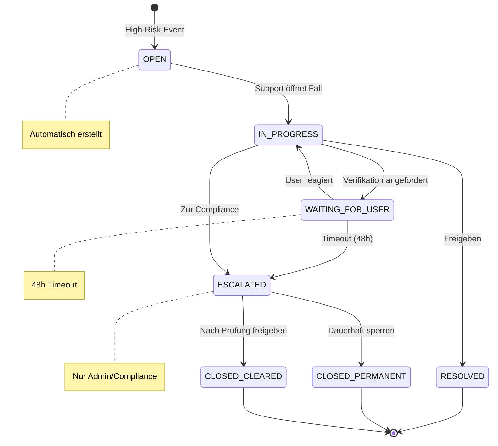

# CargoBit Support Team UX Flows
## High-Risk Case Handling mit Eskalation

---

## Übersicht

Dieses Dokument beschreibt die drei zentralen UX-Flows für Support-Teams bei der Bearbeitung von High-Risk-Fällen:

| Flow | Trigger | Hauptakteur |
|------|---------|-------------|
| **Flow 1** | HIGH-RISK Event automatisch erkannt | System → Support |
| **Flow 2** | Support öffnet und entscheidet | Support Agent |
| **Flow 3** | Eskalation an Compliance | Admin / Compliance |

---

## Flow 1: Eingehender High-Risk-Fall

### System-Automatisierung

```mermaid
flowchart TD
    subgraph Trigger["🎯 Trigger"]
        A[User Action] --> B[POST /security/check]
    end
    
    subgraph SecurityGateway["🔒 Security Gateway"]
        B --> C{Risk Score?}
        C -->|0-30 GREEN| D1[✅ Allowed]
        C -->|31-60 YELLOW| D2[⚠️ Allowed + Mitigations]
        C -->|61-100 RED| D3[🚫 Blocked]
    end
    
    subgraph HighRiskHandler["🚨 High-Risk Event Handler"]
        D3 --> E1[Create Support Ticket]
        E1 --> E2[Status: OPEN]
        E1 --> E3[Priority: HIGH/CRITICAL]
        
        E2 --> F1[📧 Email an Security-Team]
        E2 --> F2[💬 Slack #security-alerts]
        E2 --> F3[📱 SMS bei Score ≥ 90]
    end
    
    subgraph Dashboard["📊 Risk Dashboard"]
        F1 --> G[Neuer Fall in<br/>"High-Risk Cases"]
        F2 --> G
        F3 --> G
        G --> H[Support sieht Notification]
    end
    
    style D3 fill:#E74C3C,color:#fff
    style E1 fill:#F39C12,color:#fff
    style G fill:#2D8CFF,color:#fff
```

### Support-UI: Liste "Offene High-Risk Fälle"

```
┌─────────────────────────────────────────────────────────────────────────────────────────┐
│ 🚨 HIGH-RISK CASES                                              [Filter] [Export]   │
├─────────────────────────────────────────────────────────────────────────────────────────┤
│                                                                                         │
│  ┌───────┬─────────────┬───────┬───────┬─────────────────┬──────────┬────────┬───────┐ │
│  │ Entity│   Entity ID │ Score │ Level │  Letztes Event  │   Zeit   │ Status │ Action│ │
│  ├───────┼─────────────┼───────┼───────┼─────────────────┼──────────┼────────┼───────┤ │
│  │  👤   │ user_78234  │  85   │  🔴   │ ACCEPT_OFFER    │ 12:34:15 │ OPEN   │[Open] │ │
│  │  🏢   │ comp_4512   │  72   │  🔴   │ INITIATE_PAYOUT │ 12:28:03 │ OPEN   │[Open] │ │
│  │  💳   │ tx_89234    │  91   │  🔴   │ ASSIGN_DRIVER   │ 11:45:22 │ OPEN   │[Open] │ │
│  │  👤   │ user_12456  │  67   │  🔴   │ ACCEPT_OFFER    │ 11:30:45 │ IN_PRO │[Open] │ │
│  │  🏢   │ comp_9823   │  78   │  🔴   │ INITIATE_PAYOUT │ 10:15:33 │ OPEN   │[Open] │ │
│  └───────┴─────────────┴───────┴───────┴─────────────────┴──────────┴────────┴───────┘ │
│                                                                                         │
│  Zeige 1-5 von 23 Fällen                              [< Prev] [1] [2] [3] [Next >]   │
└─────────────────────────────────────────────────────────────────────────────────────────┘
```

---

## Flow 2: Prüfung & Entscheidung

### Schritt 1: Support öffnet Fall

```mermaid
flowchart TD
    subgraph SupportAction["👆 Support Aktion"]
        A[Click "Öffnen"] --> B[Load Risk Profile Detail]
    end
    
    subgraph DetailView["📋 Risk Profile Detail Screen"]
        B --> C1[🎯 Score Circle 81 RED]
        B --> C2[📜 Triggered Rules]
        B --> C3[📅 Event Timeline]
        B --> C4[📊 Context Data]
        B --> C5[🔗 Linked Actions]
    end
    
    subgraph ContextData["📊 Context Details"]
        C4 --> D1[Betrag: 15.000 EUR]
        C4 --> D2[IBAN-Alter: 3 Tage]
        C4 --> D3[Geo: DE → NG]
        C4 --> D4[Historie: 2 Transaktionen]
    end
    
    style C1 fill:#E74C3C,color:#fff
```

### Detail-View UI

```
┌─────────────────────────────────────────────────────────────────────────────────────────┐
│ ← Zurück zu Cases                                                                       │
├─────────────────────────────────────────────────────────────────────────────────────────┤
│                                                                                         │
│  ┌───────────────────────────────────┐  ┌───────────────────────────────────────────┐  │
│  │        RISK SCORE                 │  │          TRIGGERED RULES                  │  │
│  │                                   │  │                                           │  │
│  │         ╭───────╮                 │  │  🔴 HIGH_AMOUNT_NEW_USER (+25)            │  │
│  │        │   81  │                 │  │  🔴 NEW_IBAN (+20)                        │  │
│  │        │  RED  │                 │  │  🔴 GEO_MISMATCH (+15)                    │  │
│  │         ╰───────╯                 │  │  🟡 FIRST_PAYOUT (+10)                    │  │
│  │                                   │  │  🟡 LOW_HISTORY (+11)                     │  │
│  │  Entity: user_78234               │  │                                           │  │
│  │  Action: ACCEPT_OFFER             │  │  Total: 81 → RED                          │  │
│  └───────────────────────────────────┘  └───────────────────────────────────────────┘  │
│                                                                                         │
│  ┌───────────────────────────────────────────────────────────────────────────────────┐  │
│  │ 📊 CONTEXT                                                                         │  │
│  ├───────────────────────────────────────────────────────────────────────────────────┤  │
│  │  Betrag:           5.000 EUR          │  IBAN-Alter:      3 Tage                  │  │
│  │  Währung:          EUR                │  User-Alter:      14 Tage                 │  │
│  │  Ziel-IBAN:        DE89***13000       │  Transaktionen:   2                       │  │
│  │  Geo-Location:     Lagos, NG          │  Letzte Aktion:   Vor 2 Stunden           │  │
│  └───────────────────────────────────────────────────────────────────────────────────┘  │
│                                                                                         │
│  ┌───────────────────────────────────────────────────────────────────────────────────┐  │
│  │ 📅 EVENT TIMELINE                                                                  │  │
│  ├───────────────────────────────────────────────────────────────────────────────────┤  │
│  │  12:34:15  🚫  Action BLOCKED - Risk Score 81                                     │  │
│  │  12:34:14  📧  Ticket created: st_1704067200000_ghi789                            │  │
│  │  12:34:14  💬  Slack alert sent to #security-alerts                               │  │
│  │  12:33:45  🔍  Risk evaluation started                                            │  │
│  │  12:33:44  📥  ACCEPT_OFFER request received                                      │  │
│  └───────────────────────────────────────────────────────────────────────────────────┘  │
│                                                                                         │
│  ┌───────────────────────────────────────────────────────────────────────────────────┐  │
│  │ 🎬 ACTIONS                                                                         │  │
│  ├───────────────────────────────────────────────────────────────────────────────────┤  │
│  │                                                                                   │  │
│  │  [✅ Freigeben]     [📋 Verifikation anfordern]     [🚫 Sperren/Eskalieren]        │  │
│  │                                                                                   │  │
│  └───────────────────────────────────────────────────────────────────────────────────┘  │
└─────────────────────────────────────────────────────────────────────────────────────────┘
```

### Schritt 2: Entscheidungspfade

```mermaid
flowchart TD
    subgraph SupportDecision["🎯 Support Entscheidungen"]
        A[Support wählt Aktion] --> B{Welche Aktion?}
    end
    
    subgraph Option1["✅ Option 1: Freigeben"]
        B -->|Freigeben| C1[Bestätigungsdialog]
        C1 --> C2{"Bist du sicher, dass du<br/>diesen Fall freigeben möchtest?"}
        C2 -->|Ja| C3[POST /risk/override]
        C3 --> C4[Set manual_override Flag]
        C3 --> C5[Score → YELLOW/GREEN]
        C3 --> C6[Ticket → RESOLVED]
        C6 --> C7[📧 User Notification]
        C2 -->|Nein| A
    end
    
    subgraph Option2["📋 Option 2: Verifikation anfordern"]
        B -->|Verifikation| D1[Verifikations-Formular]
        D1 --> D2[Kommentar eingeben]
        D1 --> D3[Verifikations-Typ wählen]
        D3 --> D4["• Dokument hochladen<br/>• Selfie-Verifikation<br/>• Firmenunterlagen"]
        D4 --> D5[POST /risk/request-verification]
        D5 --> D6[Ticket → WAITING_FOR_USER]
        D6 --> D7[📧 Task an User gesendet]
    end
    
    subgraph Option3["🚫 Option 3: Sperren/Eskalieren"]
        B -->|Sperren| E1[Aktion wählen]
        E1 -->|Nutzer sperren| E2[Account Status → BLOCKED]
        E1 -->|Zur Compliance| E3[Ticket → ESCALATED]
        E2 --> E4[Ticket → CLOSED<br/>Reason: PERMANENT_BLOCK]
        E3 --> E5[Sichtbar in<br/>"Compliance Cases"]
        E4 --> E6[📧 User Notification]
    end
    
    style C1 fill:#2ECC71,color:#fff
    style D1 fill:#F1C40F,color:#fff
    style E1 fill:#E74C3C,color:#fff
```

---

## Flow 3: Eskalation & Abschluss

### Eskalationspfad zu Compliance

```mermaid
flowchart TD
    subgraph Escalation["⬆️ Eskalation"]
        A[Ticket Status: ESCALATED] --> B[Tab "Compliance Cases"]
    end
    
    subgraph ComplianceView["🏛️ Compliance Dashboard"]
        B --> C1[Nur ADMIN/COMPLIANCE<br/>sichtbar]
        B --> C2[Erweiterte Details]
        B --> C3[Full Audit Trail]
    end
    
    subgraph FinalDecision["⚖️ Finale Entscheidung"]
        C2 --> D{Compliance entscheidet}
        D -->|Dauerhaft sperren| E1[Account bleibt BLOCKED]
        D -->|Freigeben nach Prüfung| E2[Account → ACTIVE]
        
        E1 --> F1[Risk Score bleibt hoch]
        E1 --> F2[Ticket → CLOSED]
        E1 --> F3[Reason: PERMANENT_BLOCK]
        
        E2 --> G1[Risk Score reduziert]
        E2 --> G2[Ticket → CLOSED]
        E2 --> G3[Reason: CLEARED]
    end
    
    subgraph UserCommunication["📧 User Kommunikation"]
        F3 --> H1["Dein Konto wurde aus<br/>Sicherheitsgründen gesperrt."]
        G3 --> H2["Deine Aktion wurde nach<br/>Prüfung freigegeben."]
    end
    
    style E1 fill:#E74C3C,color:#fff
    style E2 fill:#2ECC71,color:#fff
```

### Compliance Cases UI

```
┌─────────────────────────────────────────────────────────────────────────────────────────┐
│ 🏛️ COMPLIANCE CASES                                  [Admin/Compliance Only]           │
├─────────────────────────────────────────────────────────────────────────────────────────┤
│                                                                                         │
│  ┌───────┬─────────────┬───────┬───────┬─────────────────┬──────────┬──────────┬─────┐ │
│  │ Entity│   Entity ID │ Score │ Level │  Letztes Event  │  Escalated│ Status  │Action│ │
│  ├───────┼─────────────┼───────┼───────┼─────────────────┼──────────┼──────────┼─────┤ │
│  │  👤   │ user_78234  │  85   │  🔴   │ FRAUD_SUSPECTED │ 12:45:00 │ ESCALATED│[...]│ │
│  │  🏢   │ comp_4512   │  72   │  🔴   │ KYB_FAILED      │ 11:30:00 │ ESCALATED│[...]│ │
│  │  💳   │ tx_89234    │  91   │  🔴   │ MONEY_LAUNDER   │ 10:15:00 │ UNDER_REV│[...]│ │
│  └───────┴─────────────┴───────┴───────┴─────────────────┴──────────┴──────────┴─────┘ │
│                                                                                         │
│  ┌───────────────────────────────────────────────────────────────────────────────────┐  │
│  │ FALL: user_78234                                                                  │  │
│  ├───────────────────────────────────────────────────────────────────────────────────┤  │
│  │                                                                                   │  │
│  │  Escalation Reason:   Verdacht auf Betrug - Mehrere High-Risk Events             │  │
│  │  Escalated By:        support_agent_45                                           │  │
│  │  Escalated At:        15.04.2026 12:45:00                                        │  │
│  │  Previous Decisions:  3x Freigaben in letzten 7 Tagen                            │  │
│  │                                                                                   │  │
│  │  ┌─────────────────────────────────────────────────────────────────────────────┐  │  │
│  │  │ 📜 FULL AUDIT TRAIL                                                        │  │  │
│  │  │  15.04.2026 12:45  ESCALATED   support_agent_45 → compliance               │  │  │
│  │  │  15.04.2026 12:34  BLOCKED     Risk Score 81                               │  │  │
│  │  │  15.04.2026 10:22  BLOCKED     Risk Score 76                               │  │  │
│  │  │  14.04.2026 18:15  RELEASED    support_agent_22 - Manual Override          │  │  │
│  │  │  14.04.2026 18:10  BLOCKED     Risk Score 72                               │  │  │
│  │  └─────────────────────────────────────────────────────────────────────────────┘  │  │
│  │                                                                                   │  │
│  │  [🔒 Dauerhaft sperren]              [✅ Nach Prüfung freigeben]                  │  │
│  │                                                                                   │  │
│  └───────────────────────────────────────────────────────────────────────────────────┘  │
└─────────────────────────────────────────────────────────────────────────────────────────┘
```

---

## User-Kommunikation Templates

### Bei Sperre

```json
{
  "template_id": "account_blocked",
  "subject": "Dein CargoBit-Konto wurde gesperrt",
  "body": {
    "de": "Dein Konto wurde aus Sicherheitsgründen gesperrt. Bitte kontaktiere den Support unter support@cargobit.com, wenn du Fragen hast.",
    "en": "Your account has been locked for security reasons. Please contact support at support@cargobit.com if you have questions."
  },
  "channels": ["email", "in_app"]
}
```

### Bei Freigabe

```json
{
  "template_id": "action_released",
  "subject": "Deine Aktion wurde freigegeben",
  "body": {
    "de": "Deine Aktion wurde nach Prüfung freigegeben. Du kannst sie jetzt erneut ausführen.",
    "en": "Your action has been released after review. You can now retry it."
  },
  "channels": ["email", "in_app", "push"]
}
```

### Bei Verifikations-Anforderung

```json
{
  "template_id": "verification_required",
  "subject": "Verifikation erforderlich",
  "body": {
    "de": "Für deine letzte Aktion ist eine zusätzliche Verifikation erforderlich. Bitte lade die angeforderten Dokumente hoch.",
    "en": "Additional verification is required for your recent action. Please upload the requested documents."
  },
  "action_url": "/verification/{ticket_id}",
  "channels": ["email", "in_app", "push", "sms"]
}
```

---

## State Machine: Ticket Status



---

## API Endpoints für Support-Aktionen

### Freigeben
```http
POST /risk/override
Content-Type: application/json
Authorization: Bearer <service-token>

{
  "ticketId": "st_1704067200000_ghi789",
  "action": "release",
  "reason": "Manual verification completed - ID confirmed",
  "overrideBy": "support_agent_45"
}
```

### Verifikation anfordern
```http
POST /risk/request-verification
Content-Type: application/json
Authorization: Bearer <service-token>

{
  "ticketId": "st_1704067200000_ghi789",
  "verificationType": "DOCUMENT_UPLOAD",
  "requiredDocuments": ["ID_FRONT", "ID_BACK", "SELFIE"],
  "comment": "Bitte laden Sie einen gültigen Ausweis hoch",
  "requestedBy": "support_agent_45"
}
```

### Sperren / Eskalieren
```http
POST /risk/escalate
Content-Type: application/json
Authorization: Bearer <service-token>

{
  "ticketId": "st_1704067200000_ghi789",
  "action": "escalate_to_compliance",
  "reason": "Verdacht auf Betrug - Multiple High-Risk Events",
  "escalatedBy": "support_agent_45"
}
```

---

## Zusammenfassung

| Flow | Dauer (SLA) | Verantwortlich | Kanäle |
|------|-------------|----------------|--------|
| Flow 1: Event → Ticket | < 1 Sek | System | Email, Slack, SMS |
| Flow 2: Prüfung | < 4h | Support | Dashboard |
| Flow 3: Eskalation | < 24h | Compliance | Dashboard |

**Kennzahlen:**
- 95% der HIGH-RISK Fälle innerhalb 4h bearbeitet
- 99% der kritischen Fälle (Score ≥ 90) innerhalb 1h bearbeitet
- 100% Audit-Trail für Compliance-Reporting
