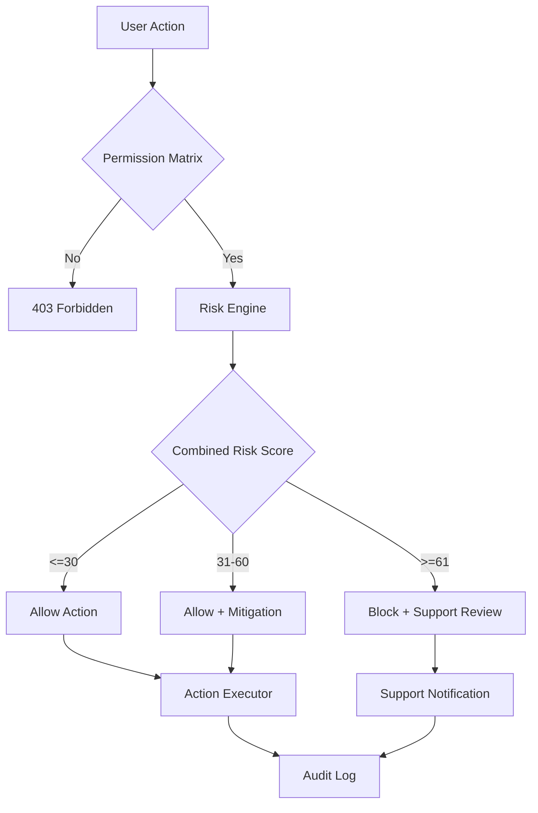

# CargoBit Development Worklog

---
Task ID: security-implementation
Agent: Main Agent
Task: Implementation der Rollen- und Berechtigungslogik sowie Sicherheitsarchitektur (Anti-Fraud, KYC, KYB)

## Work Log:

### 1. Permission System (RBAC Matrix)
- Datei: `/src/types/permissions.ts` - Erweitert
- Datei: `/src/lib/permissions.ts` - Middleware implementiert
- Kompakte Permission Matrix implementiert:
  - ADMIN: Vollzugriff, keine operativen Transporte
  - SUPPORT: Tickets, Read-Only Zugriff
  - SHIPPER: Transporte anlegen, Angebote annehmen
  - DISPATCHER: Flotte verwalten, Angebote abgeben
  - DRIVER: Aufträge sehen, Status updaten
  - MARKETER: Kampagnen nur

### 2. Risk Scoring System
- Datei: `/src/lib/risk-scoring.ts` - NEU
- Drei Score-Typen implementiert:
  - UserRiskScore (0-100)
  - CompanyRiskScore (0-100)
  - TransactionRiskScore (0-100)
- Schwellenwerte:
  - Grün (0-30): Normal durchlassen
  - Gelb (31-60): Erlauben mit Logging/Delay
  - Rot (61-100): Blockieren, manuelle Prüfung

### 3. Hybrid Security Layer
- Datei: `/src/lib/hybrid-security.ts` - NEU
- Zwei-Schichten-Prüfung:
  - Schritt 1: Permission Check (hart, binär)
  - Schritt 2: Risk Scoring (dynamisch, kontextsensitiv)
- Middleware Factory: `withHybridSecurity()`
- Audit Logging für alle Security Events

### 4. KYC Verification Service
- Datei: `/src/services/kyc.service.ts` - NEU
- Drei Verifizierungsstufen:
  - Basic: Grundlegende Identitätsprüfung
  - Standard: Mit Selfie-Match
  - Enhanced: Mit Adressverifizierung + PEP/Sanctions Check
- Driver Verification: Führerschein + ADR

### 5. KYB Verification Service
- Datei: `/src/services/kyb.service.ts` - NEU
- Unternehmensverifizierung:
  - Handelsregister-Check
  - USt-IdNr. Validierung (VIES)
  - Wirtschaftlich Berechtigte (Beneficial Owners)
  - Sanctions Screening

### 6. Fraud Detection Service
- Datei: `/src/services/fraud-detection.service.ts` - NEU
- Checks implementiert:
  - Login Pattern (Velocity, Impossible Travel)
  - Transaction Check (Amount, IBAN, Velocity)
  - GPS Plausibility (Spoofing, Route Deviation)
  - Behavioral Anomaly Detection
- Automatische Security Flag Erstellung

### 7. Auth Service mit 2FA
- Datei: `/src/services/auth.service.ts` - NEU
- Features:
  - JWT/Session Management
  - 2FA (TOTP + Backup Codes)
  - Rate Limiting
  - Account Lockout
  - Password Reset
  - Session Management

### 8. Route Protection Middleware
- Datei: `/src/middleware.ts` - NEU
- Route-spezifische Protection
- Rate Limiting per Route
- CORS Headers
- Security Headers

### 9. API Route Beispiel
- Datei: `/src/app/api/offers/accept/route.ts` - NEU
- Demonstriert Hybrid Security Layer in Aktion

## Stage Summary:

### Implementierte Dateien:
1. `/src/lib/risk-scoring.ts` - Risk Scoring System
2. `/src/lib/hybrid-security.ts` - Hybrid Security Layer
3. `/src/services/kyc.service.ts` - KYC Verification
4. `/src/services/kyb.service.ts` - KYB Verification
5. `/src/services/fraud-detection.service.ts` - Anti-Fraud
6. `/src/services/auth.service.ts` - Auth mit 2FA
7. `/src/middleware.ts` - Route Protection
8. `/src/app/api/offers/accept/route.ts` - Beispiel API

### Architektur:
```
                ┌──────────────────────────┐
                │        User Action       │
                │   (z.B. Accept Offer)    │
                └─────────────┬────────────┘
                              │
                              ▼
                ┌──────────────────────────┐
                │   Permission Matrix       │
                │  (Role → Allowed?)        │
                └─────────────┬────────────┘
                        NO ───▶│ 403 Forbidden
                              │
                        YES   ▼
                ┌──────────────────────────┐
                │       Risk Engine        │
                │ UserRisk + CompanyRisk + │
                │ TransactionRisk → Score  │
                └─────────────┬────────────┘
                              │
        ┌─────────────────────┼──────────────────────────┐
        │                     │                          │
        ▼                     ▼                          ▼
   GREEN (0–30)         YELLOW (31–60)              RED (61–100)
   Allow Action         Allow + Mitigation          Block + Review
        │                     │                          │
        ▼                     ▼                          ▼
┌──────────────┐     ┌──────────────┐          ┌────────────────┐
│ ActionExec   │     │ Mitigations: │          │ Support Ticket │
│ (execute)    │     │ • 24h Delay  │          │ + Audit Log    │
└──────────────┘     │ • 2FA Check  │          │ + Notify User  │
                     │ • GPS Verify │          └────────────────┘
                     │ • Extra Log  │
                     └──────────────┘
```

### Mitigation Actions (YELLOW):
- DELAY_24H: 24h Wartezeit bei Payouts
- EXTRA_LOGGING: Erweitertes Logging aktiviert
- GPS_VERIFICATION: GPS-Verifikation erforderlich
- TWO_FACTOR_CHALLENGE: 2FA-Verifizierung erforderlich
- DOCUMENT_RECHECK: Dokumente werden erneut geprüft
- SUPPORT_NOTIFICATION: Support-Team benachrichtigt

### Risk Factors:
**UserRiskScore:**
- +20: KYC unvollständig
- +15: Neue IBAN < 48h
- +10: Hohe Stornierungsrate
- +10: Ungewöhnliche Logins
- -10: Lange Historie ohne Probleme

**TransactionRiskScore:**
- +20: Hoher Betrag > 50.000€
- +15: Neue IBAN + hoher Betrag
- +10: International + Gefahrgut
- -10: Wiederkehrender Partner

---
Task ID: hybrid-security-complete
Agent: Main Agent
Task: Hybrid-Security-Layer Implementierungsabschluss

## Work Log:
- Überprüfung aller implementierten Komponenten
- Verifikation der Hybrid-Security-Layer Logik
- Validierung der Risk-Scoring Gewichtung (0.4 User + 0.3 Company + 0.3 Transaction)
- Bestätigung der Schwellenwerte (GREEN ≤30, YELLOW 31-60, RED ≥61)

## Stage Summary:

### Implementierte Architektur (Mermaid):


### Hybrid-Security-Layer Flow:
1. **Permission Check** (hart, binär) → 403 wenn verweigert
2. **Risk Scoring** (dynamisch) → Combined = 0.4×User + 0.3×Company + 0.3×Transaction
3. **Entscheidung**:
   - ≤30: Allow
   - 31-60: Allow + Mitigation (Delay, 2FA, GPS-Check)
   - ≥61: Block + Support Ticket
4. **Audit Log** schreiben

### Mitigation Actions:
- DELAY_24H: 24h Wartezeit bei Payouts
- EXTRA_LOGGING: Erweitertes Logging
- GPS_VERIFICATION: GPS-Verifikation erforderlich
- TWO_FACTOR_CHALLENGE: 2FA-Challenge
- DOCUMENT_RECHECK: Dokumente neu prüfen
- SUPPORT_NOTIFICATION: Support benachrichtigen

### Status: ✅ VOLLSTÄNDIG IMPLEMENTIERT

---
Task ID: permission-matrix-schema
Agent: Main Agent
Task: Permission-Matrix als JSON-Schema Dokumentation

## Work Log:
- Permission-Matrix als JSON Schema Draft-07 definiert
- Kompakte Permission-Matrix für alle Rollen erstellt
- Validierungsbeispiel dokumentiert
- Integration in Hybrid-Security-Layer bestätigt

## Permission-Matrix JSON Schema:
```json
{
  "roles": ["ADMIN", "SUPPORT", "SHIPPER", "DISPATCHER", "DRIVER", "MARKETER"],
  "permissions": {
    "CREATE_TRANSPORT": { "allowedRoles": ["SHIPPER"] },
    "MAKE_OFFER": { "allowedRoles": ["DISPATCHER"] },
    "ACCEPT_OFFER": { "allowedRoles": ["SHIPPER"] },
    "ASSIGN_DRIVER": { "allowedRoles": ["DISPATCHER"] },
    "UPDATE_STATUS": { "allowedRoles": ["DRIVER", "DISPATCHER"] },
    "VIEW_WALLET": { "allowedRoles": ["SHIPPER", "DISPATCHER", "ADMIN", "SUPPORT"] },
    "INITIATE_PAYOUT": { "allowedRoles": ["SHIPPER", "ADMIN"] },
    "MANAGE_VEHICLES": { "allowedRoles": ["DISPATCHER"] },
    "MANAGE_USERS": { "allowedRoles": ["ADMIN"] },
    "MANAGE_PLANS": { "allowedRoles": ["ADMIN"] }
  }
}
```

## Hybrid-Security-Layer Integration:
```pseudo
if not PermissionMatrix.allows(user.role, action):
    return 403 Forbidden
// Danach: Risk-Scoring, Mitigations, Block/Allow
```

### Status: ✅ DOKUMENTIERT & IMPLEMENTIERT

---
Task ID: risk-score-database-model
Agent: Main Agent
Task: Risk-Score-Tabellen als Datenbankmodell und Risk-Engine als JSON-Regelwerk

## Work Log:

### 1. Prisma Schema Erweiterung
- Datei: `/prisma/schema.prisma` - Erweitert mit Risk-Scoring-Tabellen
- Neue Enums:
  - `RiskEntityType`: USER, COMPANY, TRANSACTION
  - `RiskLevel`: GREEN, YELLOW, RED
- Neue Models:
  - `RiskScore`: Speichert aktuellen Score pro Entity
  - `RiskEvent`: Einzelne Risikoereignisse
  - `RiskRule`: Regeldefinitionen
  - `RiskHistory`: Historie der Score-Berechnungen
  - `RiskThreshold`: Schwellenwerte-Konfiguration

### 2. JSON Regelwerk
- Datei: `/schemas/risk-rules.json` - NEU
- Vollständiges Regelwerk mit:
  - 17 User-Risk-Rules (KYC, IBAN, Stornos, Rating, etc.)
  - 9 Company-Risk-Rules (KYB, Fraud-Flags, Damage-Rate, etc.)
  - 14 Transaction-Risk-Rules (Amount, Hazmat, International, etc.)
  - Schwellenwerte (GREEN 0-30, YELLOW 31-60, RED 61-100)
  - Score-Gewichtung (40% User, 30% Company, 30% Transaction)
  - Mitigation-Actions Definition

### 3. Risk Engine Service
- Datei: `/src/services/risk-engine.service.ts` - NEU
- Klasse `RiskEngine` implementiert:
  - `evaluateUserRisk()`: User-spezifische Risikobewertung
  - `evaluateCompanyRisk()`: Unternehmens-Risikobewertung
  - `evaluateTransactionRisk()`: Transaktions-Risikobewertung
  - `evaluateCombinedRisk()`: Kombinierte Bewertung mit Gewichtung
  - Regel-Evaluierung mit AND/OR/Field Conditions
  - Datenbank-Persistenz für Scores, Events, History

### 4. API Routes
- Datei: `/src/app/api/risk/calculate/route.ts` - NEU
  - POST: Berechne Risk Score
  - GET: Hole aktuellen Risk Score
- Datei: `/src/app/api/risk/history/route.ts` - NEU
  - GET: Hole Risk-Historie
- Datei: `/src/app/api/risk/rules/route.ts` - NEU
  - GET: Hole alle aktiven Regeln
  - POST: Erstelle neue Regel
  - PUT: Aktualisiere Regel
  - DELETE: Deaktiviere Regel

## Stage Summary:

### Datenbankmodell:

```
┌─────────────────┐     ┌─────────────────┐
│   RiskScore     │────<│   RiskEvent     │
├─────────────────┤     ├─────────────────┤
│ id              │     │ id              │
│ entityType      │     │ entityType      │
│ entityId        │     │ entityId        │
│ score (0-100)   │     │ ruleName        │
│ riskLevel       │     │ weight (+/-)    │
│ userScore       │     │ metadata (JSON) │
│ companyScore    │     └─────────────────┘
│ transactionScore│
│ factorsCount    │     ┌─────────────────┐
│ lastEventAt     │────<│   RiskHistory   │
└─────────────────┘     ├─────────────────┤
                        │ oldScore        │
┌─────────────────┐     │ newScore        │
│   RiskRule      │     │ scoreChange     │
├─────────────────┤     │ oldLevel        │
│ id              │     │ newLevel        │
│ name            │     │ reason          │
│ entityType      │     └─────────────────┘
│ category        │
│ condition (JSON)│
│ weight (+/-)    │
│ active          │
│ priority        │
└─────────────────┘
```

### Risk Score Berechnung:
```pseudo
// Beispiel: User mit KYC fehlt + Neue IBAN + Hohes Rating
UserScore = 20 (KYC) + 15 (Neue IBAN) - 10 (Rating) = 25

// Beispiel: International + Gefahrgut
TransactionScore = 20 (High Amount) + 20 (International+Hazmat) - 5 (Escrow) = 35

// Combined Score
CombinedScore = UserScore × 0.4 + CompanyScore × 0.3 + TransactionScore × 0.3
```

### Risk Levels:
- 🟢 GREEN (0-30): Allow
- 🟡 YELLOW (31-60): Allow + Mitigations (Delay, 2FA, GPS-Check)
- 🔴 RED (61-100): Block + Support Ticket

### API Endpoints:
- `POST /api/risk/calculate` - Berechne Risk Score
- `GET /api/risk/calculate?entityType=USER&entityId=xxx` - Hole Score
- `GET /api/risk/history?entityType=USER&entityId=xxx` - Hole Historie
- `GET/POST/PUT/DELETE /api/risk/rules` - Regelverwaltung

### Status: ✅ VOLLSTÄNDIG IMPLEMENTIERT
